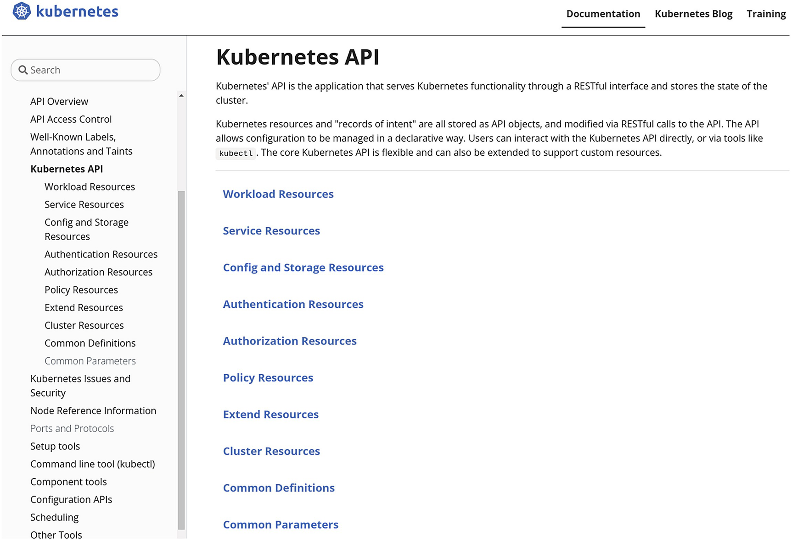
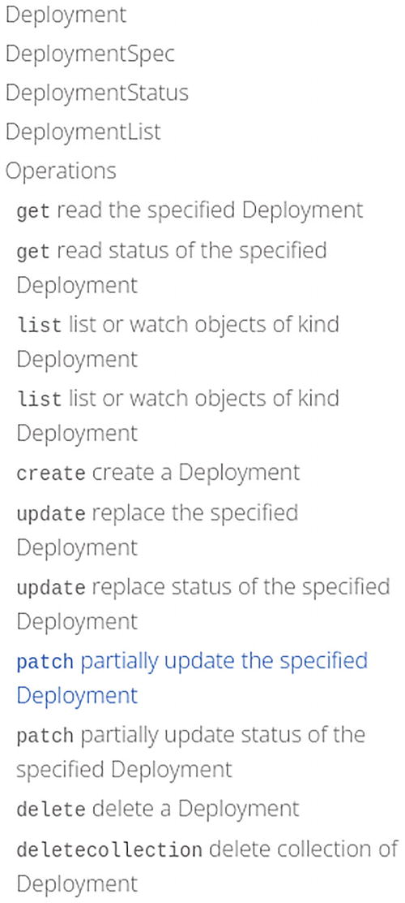
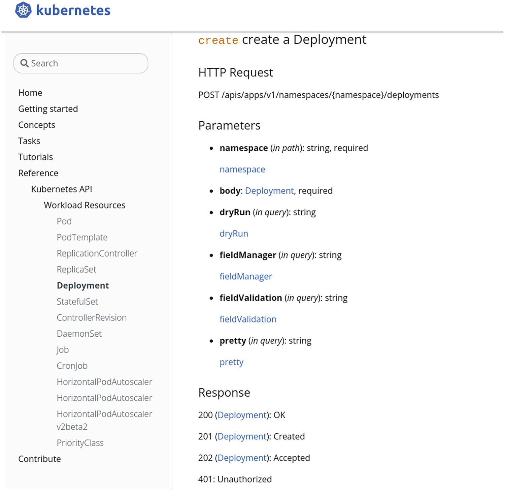

该API的官方参考文档在 https://kubernetes.io/docs/reference/kubernetes-api/。API管理的资源首先按类别（即工作负载、存储等）分组，对于每个类别，你可以获得一个带有简短描述的资源名称列表（图1-3）。

> 注意，这些类别并不是 Kubernetes API 定义的一部分，而是在本网站中用来帮助没有经验的用户在众多的可用资源中找到自己的方向。



准确地说，显示的名称不是REST意义上的资源名称，而是相关的主体种类，如图1-4所示。例如，在管理Pod时，REST路径中使用的资源名称是pods（即小写和复数），而在HTTP请求中用于交换Pod信息的定义被命名为Pod（即大写和单数）。请注意，其他种类可以与同一资源相关联。在本章的例子中，PodList种类（用于交换关于Pod列表的信息）也存在。

### Deployment 文档

让我们来探讨一下这个地址提供的 Deployment 的参考文档：https://kubernetes.io/docs/reference/kubernetes-api/workload-resources/deployment-v1/。该页的标题 "Deployment" 是与图1-5所示的 Deployment 资源有关的主要种类。

头中指出的 apiVersion 可以帮助您为部署资源编写 YAML 清单，因为您需要为 Kubernetes 清单中的每个资源指定 apiVersion 和 kind。

在这种情况下，您知道部署的清单将以下列内容开始：

```
apiVersion: apps/v1
kind: Deployment
```
下一个 header 指出了编写Go代码时要使用的 import 。在第三章中，你将看到在Go中描述资源时如何使用这个导入。

在 header 之后，描述了一个结构体定义的列表，也可以从图1-6中的 Deployment 文档页的目录中获取。第一个是资源的主要种类（kind），后面可以选择用于第一种领域的结构体定义。



例如，Deployment kind 包含一个 `spec` 字段，类型为 `DeploymentSpec`，这将在后面描述。请注意，`DeploymentSpec` 不是在HTTP请求期间直接交换的结构体，因此，它不是一个 kind ，也不包含 kind 或 apiVersion 字段。

在主要 kind 及其相关定义之后，将显示与该资源相关的其他 kind。在本例中，是 DeploymentList kind。

### 操作文档

资源的API文档的下一个主题是对该资源或其子资源可能进行的操作列表，也可以从目录页中访问（见图1-6）。如图1-7所示，通过检查创建部署的操作细节，你可以看到要使用的HTTP请求动词和路径、请求过程中要传递的参数，以及可能的响应。请求使用的HTTP动词是POST，路径是 `/apis/apps/v1/namespaces/{namespace}/deployments`。



路径的 `{namespace} `部分表示一个路径参数，它将被你想在其上创建部署的命名空间的名称所取代。你可以指定查询参数：dryRun、fieldManager、fieldValidation 和 pretty。这些参数将遵循格式为 `path?dryRun=All` 的路径。

请求的主体必须是一个**Deployment** 的种类。当使用 kubectl 时，你正在编写包含这个主体的 Kubernetes Manifest。在第三章中，你将看到如何在Go中构建主体。响应的HTTP代码可能是： 200、201、202和401；对于2xx代码，响应体将包含一个 Deployment 类型。

### pod文档

有些结构体包含许多字段。对于它们，Kubernetes API 文档对字段进行了分类。一个例子是Pod资源的文档。

Pod 资源的文档页面首先包含主要种类 Pod 的描述，然后是 PodSpec 结构体的描述。PodSpec 结构体包含约40个字段。为了帮助你理解这些字段之间的关系，并简化它们的探索，它们被安排成不同的分类（categories）。PodSpec 字段的分类如下： *Containers*, *Volumes*, *Scheduling*, *Lifecycle*，等等。

此外，对于包含嵌套字段的字段，它们的描述一般是 inline 显示，以避免在结构体描述之间来回穿梭。然而，对于复杂的结构体，描述会随后在页面上报告，并且在字段名旁边有一个链接，以便能够方便地访问它。

对于 Spec 和 Status 结构来说，这种情况一直存在，因为它们在几乎所有的资源中都非常常见。此外，Pod中使用的一些结构体也是如此--例如，Container、EphemeralContainer、LifecycleHandler、NodeAffinity等等。

一些在多个资源中使用的结构被放置在通用定义部分，在字段名旁边有一个链接，可以很容易地访问它。在图1-8中，你可以看到 PodSpec 结构描述里面的容器类别。


你还可以看到，**containers** 和 initContainers 这些字段的类型与Container相同，Container在本页后面有描述，可以通过链接访问。imagePullSecrets字段的类型是 LocalObjectReference，这在通用定义部分有描述，也可以通过链接访问。

### 单页版的文档

另一个版本的API参考文档存在，并在一个页面上呈现。这个版本涵盖了一个Kubernretes版本所服务的所有资源版本（不仅仅是最新的版本）。这个版本（如果你想，改变路径的最后部分，以导航到另一个Kubernetes版本）可以在以下网址找到：

https://kubernetes.io/docs/reference/generated/kubernetes-api/v1.24/

### 总结

在本章中，你已经能够发现Kubernetes平台的架构，以及API server 发挥的核心作用。Kubernetes API 是一个HTTP REST API，资源被分类为各种有版本的分组。

类型 kind 是用于在API服务器和客户端之间交换数据的特定结构。你可以使用 Kubernetes 官方网站，以人类可读的形式浏览API规范，发现各种资源和种类的结构，每个资源和子资源的不同操作，以及它们相关的动词。
