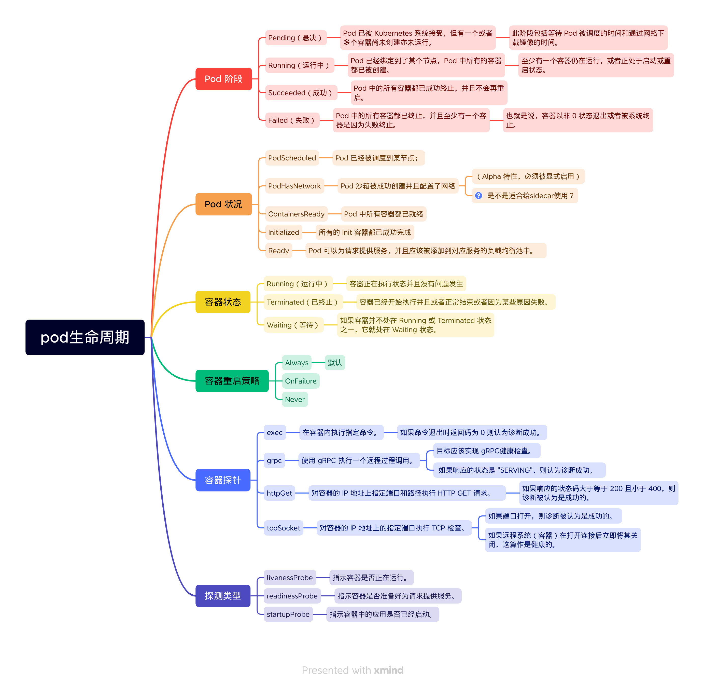

> https://kubernetes.io/zh-cn/docs/concepts/workloads/pods/pod-lifecycle/

本页面讲述 Pod 的生命周期。 Pod 遵循预定义的生命周期，起始于 `Pending` [阶段](https://kubernetes.io/zh-cn/docs/concepts/workloads/pods/pod-lifecycle/#pod-phase)， 如果至少其中有一个主要容器正常启动，则进入 `Running`，之后取决于 Pod 中是否有容器以失败状态结束而进入 `Succeeded` 或者 `Failed` 阶段。

在 Kubernetes API 中，Pod 包含规约部分和实际状态部分。 Pod 对象的状态包含了一组 Pod 状况（Conditions）。 如果应用需要的话，你也可以向其中注入自定义的就绪态信息。

Pod 在其生命周期中只会被调度一次。 一旦 Pod 被调度（分派）到某个节点，Pod 会一直在该节点运行，直到 Pod 停止或者被终止。

## Pod 生命期

**Pod 也被认为是相对临时性（而不是长期存在）的实体。** 

Pod 会被创建、赋予一个唯一的 ID（UID）， 并被调度到节点，并在终止（根据重启策略）或删除之前一直运行在该节点。

## Pod 阶段

Pod 的阶段（Phase）是 Pod 在其生命周期中所处位置的简单宏观概述。 该阶段并不是对容器或 Pod 状态的综合汇总，也不是为了成为完整的状态机。

Pod 阶段的数量和含义是严格定义的。

**除了本文档中列举的内容外，不应该再假定 Pod 有其他的 `phase` 值。**

| 取值                | 描述                                                         |
| :------------------ | :----------------------------------------------------------- |
| `Pending`（悬决）   | Pod 已被 Kubernetes 系统接受，但有一个或者多个容器尚未创建亦未运行。此阶段包括等待 Pod 被调度的时间和通过网络下载镜像的时间。 |
| `Running`（运行中） | Pod 已经绑定到了某个节点，Pod 中所有的容器都已被创建。至少有一个容器仍在运行，或者正处于启动或重启状态。 |
| `Succeeded`（成功） | Pod 中的所有容器都已成功终止，并且不会再重启。               |
| `Failed`（失败）    | Pod 中的所有容器都已终止，并且至少有一个容器是因为失败终止。也就是说，容器以非 0 状态退出或者被系统终止。 |
| `Unknown`（未知）   | 因为某些原因无法取得 Pod 的状态。这种情况通常是因为与 Pod 所在主机通信失败。 |

**说明：** 当一个 Pod 被删除时，执行一些 kubectl 命令会展示这个 Pod 的状态为 `Terminating`（终止）。 这个 `Terminating` 状态并不是 Pod 阶段之一。 Pod 被赋予一个可以体面终止的期限，默认为 30 秒。 

> 笔记： Terminating 不是 pod 阶段之一。

## 容器状态

容器的状态有三种：`Waiting`（等待）、`Running`（运行中）和 `Terminated`（已终止）。

### `Waiting` （等待）

如果容器并不处在 `Running` 或 `Terminated` 状态之一，它就处在 `Waiting` 状态。 处于 `Waiting` 状态的容器仍在运行它完成启动所需要的操作：例如， 从某个容器镜像仓库拉取容器镜像，或者向容器应用 [Secret](https://kubernetes.io/zh-cn/docs/concepts/configuration/secret/) 数据等等。 当你使用 `kubectl` 来查询包含 `Waiting` 状态的容器的 Pod 时，你也会看到一个 Reason 字段，其中给出了容器处于等待状态的原因。

### `Running`（运行中）

`Running` 状态表明容器正在执行状态并且没有问题发生。 如果配置了 `postStart` 回调，那么该回调已经执行且已完成。 如果你使用 `kubectl` 来查询包含 `Running` 状态的容器的 Pod 时， 你也会看到关于容器进入 `Running` 状态的信息。

### `Terminated`（已终止）

处于 `Terminated` 状态的容器已经开始执行并且或者正常结束或者因为某些原因失败。 如果你使用 `kubectl` 来查询包含 `Terminated` 状态的容器的 Pod 时， 你会看到容器进入此状态的原因、退出代码以及容器执行期间的起止时间。

如果容器配置了 `preStop` 回调，则该回调会在容器进入 `Terminated` 状态之前执行。

## 容器重启策略

Pod 的 `spec` 中包含一个 `restartPolicy` 字段，其可能取值包括 Always、OnFailure 和 Never。默认值是 Always。

`restartPolicy` 适用于 Pod 中的所有容器。`restartPolicy` 仅针对同一节点上 `kubelet` 的容器重启动作。当 Pod 中的容器退出时，`kubelet` 会按指数回退方式计算重启的延迟（10s、20s、40s、...），其最长延迟为 5 分钟。 一旦某容器执行了 10 分钟并且没有出现问题，`kubelet` 对该容器的重启回退计时器执行重置操作。

## Pod 状况

Pod 有一个 PodStatus 对象

Kubelet 管理以下 PodCondition：

- `PodScheduled`：Pod 已经被调度到某节点；
- `PodHasNetwork`：Pod 沙箱被成功创建并且配置了网络（Alpha 特性，必须被[显式启用](https://kubernetes.io/zh-cn/docs/concepts/workloads/pods/pod-lifecycle/#pod-has-network)）；
- `ContainersReady`：Pod 中所有容器都已就绪；
- `Initialized`：所有的 [Init 容器](https://kubernetes.io/zh-cn/docs/concepts/workloads/pods/init-containers/)都已成功完成；
- `Ready`：Pod 可以为请求提供服务，并且应该被添加到对应服务的负载均衡池中。

| 字段名称             | 描述                                                         |
| :------------------- | :----------------------------------------------------------- |
| `type`               | Pod 状况的名称                                               |
| `status`             | 表明该状况是否适用，可能的取值有 "`True`"、"`False`" 或 "`Unknown`" |
| `lastProbeTime`      | 上次探测 Pod 状况时的时间戳                                  |
| `lastTransitionTime` | Pod 上次从一种状态转换到另一种状态时的时间戳                 |
| `reason`             | 机器可读的、驼峰编码（UpperCamelCase）的文字，表述上次状况变化的原因 |
| `message`            | 人类可读的消息，给出上次状态转换的详细信息                   |

### 

### Pod 网络就绪

**特性状态：** `Kubernetes v1.25 [alpha]`

在 Pod 被调度到某节点后，它需要被 Kubelet 接受并且挂载所需的卷。 一旦这些阶段完成，Kubelet 将与容器运行时（使用[容器运行时接口（Container Runtime Interface；CRI）](https://kubernetes.io/zh-cn/docs/concepts/overview/components/#container-runtime)） 一起为 Pod 生成运行时沙箱并配置网络。 如果启用了 `PodHasNetworkCondition` [特性门控](https://kubernetes.io/zh-cn/docs/reference/command-line-tools-reference/feature-gates/)， kubelet 会通过 Pod 的 `status.conditions` 字段中的 `PodHasNetwork` 状况来报告 Pod 是否达到了初始化里程碑。

