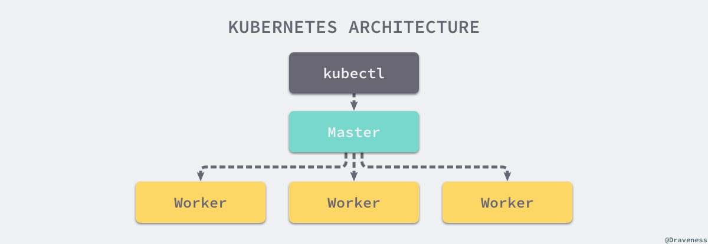
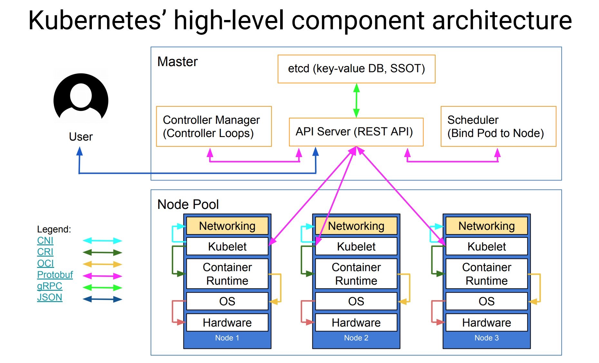

本文档概述了 Kubernetes 所需的各种二进制组件, 用于提供齐全的功能。

- Master组件
- Node组件
- 扩展（Addons）

## 整体架构

Kubernetes 遵循非常传统的客户端服务端架构，客户端通过 RESTful 接口或者直接使用 kubectl 与 Kubernetes 集群进行通信，这两者在实际上并没有太多的区别，后者也只是对 Kubernetes 提供的 RESTful API 进行封装并提供出来。

从宏观上看 Kubernetes 的整体架构，每一个 Kubernetes 集群都由 Master 节点 和 很多的 Node 节点组成。

更详细一点：

## Master组件

Master组件提供群集的控制平面。Master组件做群集全局决策（例如，调度），以及检测和响应群集事件（当副本控制器的'replicas'字段不满足时，启动新的pod）。

作为管理集群状态的 Master 节点，它主要负责接收客户端的请求，安排容器的执行并且运行控制循环，将集群的状态向目标状态进行迁移，Master 节点内部由三个组件构成：

Master组件可以在群集中的任何计算机上运行。但是，为简单起见，设置脚本通常会在同一台计算机上启动所有Master组件，并且不在此计算机上运行用户容器。

### kube-apiserver

Master上暴露Kubernetes API的组件。它是Kubernetes控制面板的前端。

其中 API Server 负责处理来自用户的请求，其主要作用就是对外提供 RESTful 的接口，包括用于查看集群状态的读请求以及改变集群状态的写请求，也是唯一一个与 etcd 集群通信的组件。

它被设计为水平扩展 - 也就是说，通过部署更多实例来扩展。 

### etcd

一致且高度可用的键值存储，用作Kubernetes的所有集群数据的存储。

始终为Kubernetes集群提供etcd数据的备份计划。

### kube-scheduler

Master上的组件，用于监视新创建而又未分配节点的的pod，根据用户的需要选择最能满足请求的节点来运行 Pod，它会在每次需要调度 Pod 时执行。

调度决策所考虑的因素包括个人和集体资源需求，硬件/软件/策略约束，亲和性和反亲和性规范，数据位置，工作负载间的干涉和最后期限。

### kube-controller-manager

Master上运行控制器的组件。

从逻辑上讲，每个控制器都是一个单独的过程，但为了降低复杂性，它们都被编译成单个二进制文件并在单个进程中运行。

而 Controller 管理器运行了一系列的控制器进程，这些进程会按照用户的期望状态在后台不断地调节整个集群中的对象，当服务的状态发生了改变，控制器就会发现这个改变并且开始向目标状态迁移。

这些控制器包括：

- 节点控制器(Node Controller): 负责在节点出现故障时注意和响应。
- 副本控制器(Replication Controller): 负责为系统中的每个副本控制器对象维护正确数量的pod。
- 端点控制器(Endpoints Controller): 填充端点对象(即连接 Services & Pods)。
- 服务帐户(Service Account)和令牌(Token)控制器: 为新的命名空间创建默认帐户和 API 访问令牌。

### cloud-controller-manager

云控制器管理器是用于与底层云提供商交互的控制器。云控制器管理器二进制是 Kubernetes v1.6 版本中引入的 Alpha 功能。

云控制器管理器仅运行云提供商特定的控制器循环。您必须在 kube-controller-manager 中禁用这些控制器循环，您可以通过在启动 kube-controller-manager 时将 --cloud-provider 标志设置为external来禁用控制器循环。

云控制器管理器允许云供应商代码和 Kubernetes 核心彼此独立发展，在以前的版本中，Kubernetes 核心代码依赖于云提供商特定的功能代码。在未来的版本中，云供应商的特定代码应由云供应商自己维护，并与运行 Kubernetes 的云控制器管理器相关联。

以下控制器具有云提供商依赖关系:

- 节点控制器（Node Controller）: 用于检查云提供商以确定节点在云中停止响应后是否被删除
- 路由控制器（Route Controller）: 用于在底层云基础架构中设置路由
- 服务控制器（Service Controller）: 用于创建，更新和删除云提供商负载均衡器
- 数据卷控制器（Volume Controller）: 用于创建，附加和装载卷，并与云提供商进行交互以协调卷

## Node组件

节点组件在每个节点上运行，维护运行的 Pod 并提供 Kubernetes 运行时环境。

### kubelet

在集群中的每个节点上运行的代理。它确保容器在pod中运行。

kubelet 是一个节点上的主要服务，它周期性地从 API Server 接受新的或者修改的 Pod 规范并且保证节点上的 Pod 和其中容器的正常运行，还会保证节点会向目标状态迁移，该节点会向 Master 节点发送宿主机的健康状况。

kubelet采用一组PodSpecs，这些PodSpecs是通过各种机制提供的。kubelet确保这些PodSpecs中描述的容器运行且健康。 kubelet不管理不是由Kubernetes创建的容器。

### kube-proxy

kube-proxy通过维护主机上的网络规则并执行连接转发来实现Kubernetes服务抽象。

运行在各个节点上的代理服务 kube-proxy 负责宿主机的子网管理，同时也能将服务暴露给外部，其原理就是在多个隔离的网络中把请求转发给正确的 Pod 或者容器。

### Container Runtime

容器运行时是负责运行容器的软件。 Kubernetes支持多种运行时：Docker，rkt，runc和任何OCI运行时规范实现。

## Addons

扩展（addons）是实现集群功能的pod和服务。可以通过 Deployments，ReplicationControllers 等管理 pod。 Namespaced 扩展对象在 kube-system 命名空间中创建。

### DNS

虽然其他插件并非严格要求，但所有Kubernetes集群都应具有集群DNS，因为许多示例都依赖于它。

Cluster DNS是为Kubernetes服务提供DNS记录的DNS服务器，除了环境中的其他DNS服务器之外。

Kubernetes启动的容器会在DNS搜索中自动包含此DNS服务器。

### Web UI (Dashboard)

Dashboard是用于Kubernetes集群的基于Web的通用UI。 允许用户管理和解决集群中运行的应用程序以及集群本身。

### Container Resource Monitoring

Container Resource Monitoring在中央数据库中记录关于容器的通用时间序列度量，并提供用于浏览该数据的UI。

### Cluster-level Logging

Cluster-level Logging机制负责将容器日志保存到具有搜索/浏览界面的中央日志存储。

### 参考资料

- [Kubernetes Components](https://kubernetes.io/docs/concepts/overview/components/): 官方文档的介绍
- [谈 Kubernetes 的架构设计与实现原理](https://draveness.me/understanding-kubernetes)
