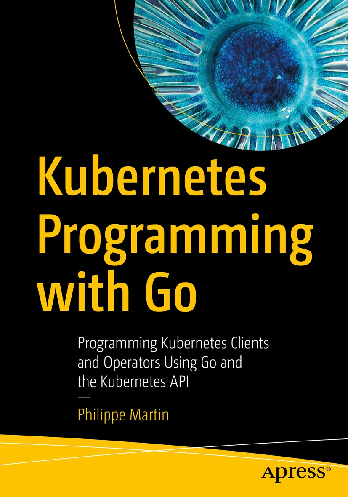

https://learning.oreilly.com/library/view/kubernetes-programming-with/9781484290262/

本书首先介绍了Kubernetes API的结构以及它为哪些运维服务。接下来的章节展示了如何使用API和API库中定义的Go结构编写本地Kubernetes资源定义。还介绍了各种实用工具，以帮助您处理不同的资源字段，并将您的资源定义转换为YAML或JSON。接下来，你将学习如何与Kubernetes API服务器互动，使用client-go库创建、删除、更新和监控集群中的资源。有一整章专门介绍了为使用 client-go库 测试你的程序而提供的工具。接下来有一个例子来总结本书的第一部分，描述了如何编写一个kubectl插件。接下来，你将学习如何使用自定义资源定义扩展Kubernetes API，以及如何以通用方式编写Kubernetes资源，以及如何使用非结构化概念创建自己的资源。接下来的章节将深入研究 controller-runtime 库，它对通过编写 operator 来扩展Kubernetes非常有用，以及利用该库的 kubebuilder 框架，帮助你在几分钟内开始编写 operator。

读完本书后，你将深入了解Kubernetes API的结构以及Kubernetes资源在其中的组织方式，并拥有一个完整的工具箱来帮助你编写Kubernetes客户端和 operator 程序。

你将学到什么

- 了解Kubernetes API及其资源是如何组织的
- 用Go编写Kubernetes资源
- 在集群中创建资源
- 利用你新获得的知识来编写Kubernetes客户端和 operator 程序
