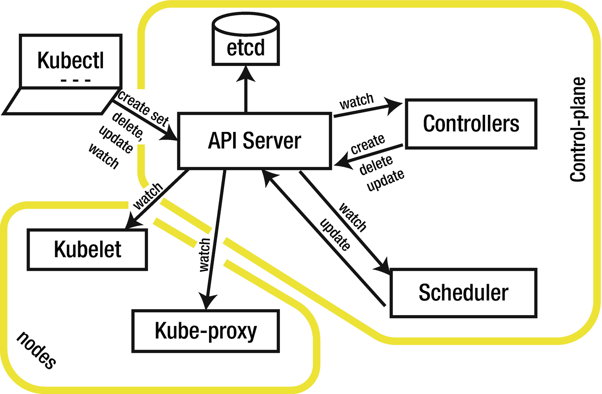

在链条的一侧，用户声明高级资源来构建要部署的应用程序： Deployments，Ingresses，等等。

在中间，controller 被激活，将这些资源转化为低级别的资源（Pod），调度器将这些资源分配到节点。在链条的另一端，节点代理将低级别的资源部署到节点上。

Kubernetes 平台的主要元素（通常称为控制平面）在图1-1中突出显示，并在下文中描述：

1. API server: 这是控制平面上的中心点；用户和控制平面的各个部分联系这个API来创建、获取、删除、更新和观察资源。

2. 
   etcd数据库: 只能由API服务器访问，用于保存与资源有关的数据。

3. 
   Controller manager: 运行 Controller，将用户声明的高级资源转化为部署在节点上的低级别资源。控制器连接到API服务器，观察高层资源，创建、删除和更新低层资源，以满足高层资源中声明的规格。

4. 
   Scheduler: 将低级资源分配到各个节点上。调度器连接到API服务器，观察未受影响的资源并将其连接到节点上。

5. 
   Kubelet: 这是一个运行在集群所有节点上的代理，每个代理都管理着影响到其节点的工作负载。kubelet 连接到 API 服务器，观察影响到其节点的Pods资源，并使用本地容器运行时部署相关容器。

6. 
   Kube proxy: 这是一个在集群的所有节点上运行的代理，每个代理都管理着影响其节点的网络配置。Kube proxy 连接到API服务器，观察服务资源并在其节点上配置相关的网络规则。

