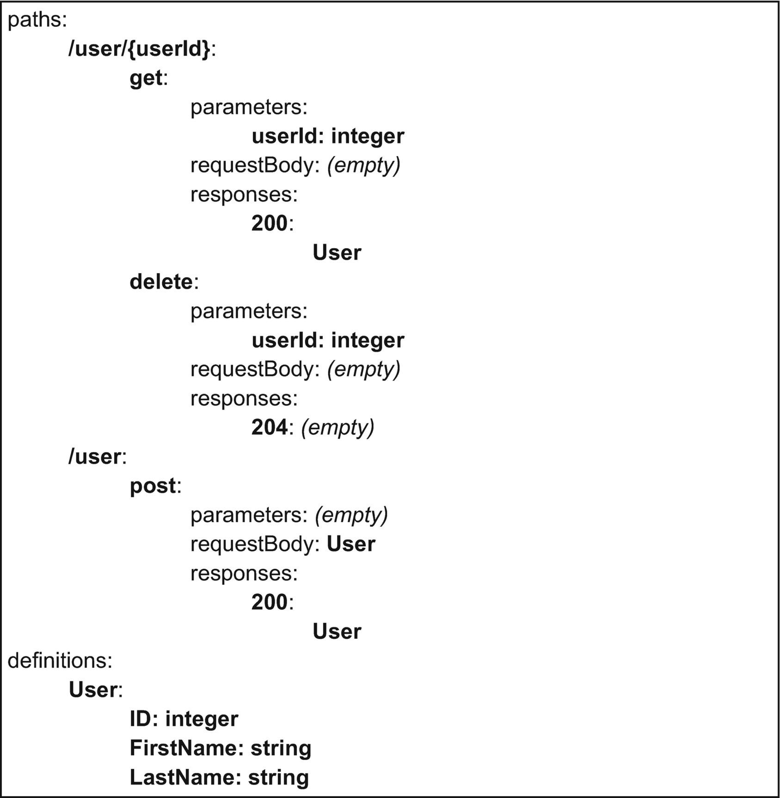

Kubernetes 的API 是HTTP REST API。Kubernetes 团队提供了 OpenAPI 格式的API规范，V2格式的规范在 https://github.com/kubernetes/kubernetes/tree/master/api/openapi-spec，Kubernetes v1.24 v3 格式的规范在 https://github.com/kubernetes/kubernetes/tree/master/api/openapi-spec/v3。

这些规范也可以从 API 服务器的这些路径访问： `/openapi/v2` 和 `/openapi/v3` 。

OpenAPI规范是由不同部分组成的，其中有路径列表和定义列表。路径是你用来请求这个API的URL，对于每个路径，规范给出了不同的操作，如 get、delte 或 post 。然后，对于每个操作，规范指出了什么是请求的参数和主体格式，以及什么是可能的响应代码和相关的响应主体格式。

请求和响应的参数和主体可以是简单的类型，也可以是更普遍的包含数据的结构。定义列表包括帮助建立操作的请求和响应的参数和主体的数据结构。

图1-2是一个 User API 规范的简化视图。这个API可以接受两个不同的路径： `/user/{userId}` 和 `/user`。第一个路径，`/user/{userId}`，可以接受两个操作，分别是 get 和 delete，用来接收特定用户的信息，给出其用户ID；以及删除特定用户的信息，给出其用户ID。第二个路径，`/user`，可以接受一个单一的操作，post，以添加一个新的用户，给定其信息。

在这个API中，给出了一个 User 结构体的定义，描述了一个用户的信息：其ID、first name 和 last name。这个数据结构被用于第一条路径上的 get 操作的响应体中，以及第二条路径上的 post 操作的请求体中。

