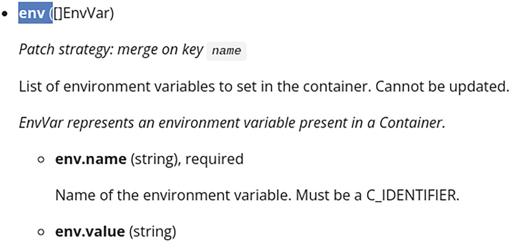

上一章介绍了 Kubernetes API 遵循 REST 原则，使用户能够操作资源。

在本章中，你将学习如何通过直接发出 HTTP 请求来执行各种操作。在你的日常工作中，你可能不需要直接与HTTP层进行交互，但了解API在这个层面上的工作原理是很重要的，这样你就能理解如何用更高层次的库更容易地使用它。

## 检查请求

在开始编写你自己的HTTP请求之前，你可以用 kubectl 检查哪些请求是在执行kubectl命令时使用的。这可以通过使用大于或等于6的 verbose 标志-v来实现。表2-1显示了在每个级别上显示的信息。

例如，如果你想知道在获取所有命名空间的pod时被调用的URL，你可以使用以下命令：

```bash
$ kubectl get pods --all-namespaces -v6

loader.go:372] Config loaded from file:  /home/user/.kube/config
round_trippers.go:553] GET https://192.168.1.194:6443/api/v1/pods?limit=500 200 OK in 745 milliseconds
```

在该命令的输出中，你可以看到使用的路径是 `/api/v1/pods`。或者，在获取特定命名空间的pod时，你可以看到使用的路径是 `/api/v1/namespaces/default/pods`

```bash
$ kubectl get pods --namespace default -v6

loader.go:372] Config loaded from file:  /home/user/.kube/config
round_trippers.go:553] GET https://192.168.1.194:6443/api/v1/namespaces/default/pods?limit=500 200 OK in 138 milliseconds
```

- 动词级别

| Level | Method and URL | Request timing | Events timing | Request headers | Response status | Response headers | Curl cmd | Body length |
| :---- | :------------- | :------------- | :------------ | :-------------- | :-------------- | :--------------- | :------- | :---------- |
| -v 6  | yes            | yes            | –             | –               | –               | –                | –        | 0           |
| -v 7  | yes            | –              | –             | yes             | yes             | –                | –        | 0           |
| -v 8  | yes            | –              | –             | yes             | yes             | yes              | -        | ≤ 1024      |
| -v 9  | yes            | yes            | yes           | –               | –               | yes              | yes      | ≤ 10240     |
| -v 10 | yes            | yes            | yes           | –               | –               | yes              | yes      | ∞           |

## 提出请求

本节研究了你可以对Kubernetes资源进行的所有操作。

### 使用 kubectl 作为代理

你必须经过认证才能向集群的 Kubernetes API 发出请求，除非你的集群接受未经认证的请求，但这是不可能的。

运行认证的HTTP请求的方法是使用kubectl作为代理，使其处理认证。为此，可以使用 `kubectl proxy`命令：

```bash
kubectl proxy
```

开始在 127.0.0.1:8001 上提供服务

在一个新的终端上，你现在可以运行你的 HTTP 请求，不需要任何认证。接下来，定义一个HOST变量来访问代理：

```bash
HOST=http://127.0.0.1:8001
```

### 创建资源

你可以通过首先创建描述该资源的Kubernetes清单来创建一个新的资源--例如，要创建一个Pod，你可以写：

```bash
cat > pod.yaml <<EOF
apiVersion: v1
kind: Pod
metadata:
  name: nginx
spec:
  containers:
  - image: nginx
    name: nginx
EOF
```


然后，你需要将资源描述传递到POST请求的正文中（注意，-X POST标志可以省略，因为使用的是 `-data-binary` 标志）。例如，要创建一个pod资源，请使用：

```bash
curl $HOST/api/v1/namespaces/project1/pods -H "Content-Type: application/yaml" --data-binary @pod.yaml
```

这等同于运行kubectl命令：

```bash
kubectl create --namespace project1 -f pod.yaml -o json
```

请注意，命名空间在 pod.yaml 文件中没有被指出。如果你添加它，你必须在 YAML 文件和路径中指定相同的命名空间，否则你会得到一个错误--即提供的对象的命名空间与请求中发送的命名空间不匹配。

### 获取资源的信息

你可以使用GET请求来获取特定资源的信息，并在路径中传递其名称作为参数（如果是命名空间的资源，还要传递其命名空间）。在这个例子中，你将请求project1命名空间中的nginx的信息：

```bash
curl -X GET $HOST/api/v1/namespaces/project1/pods/nginx
```

这将返回JSON格式的资源信息，使用与该资源相关的种类作为结构；在这个例子中，它是一个Pod种类。这等同于运行kubectl命令：

```bash
kubectl get pods --namespace project1 nginx -o json
```

### 获取资源列表

对于命名空间的资源，你可以获得整个集群或特定命名空间的资源列表。对于非命名空间的资源，你可以获得资源的列表。在任何情况下，你将使用GET请求。

#### 集群范围

要获得集群范围内的资源列表，对于带命名空间的或不带命名空间的资源；例如，对于pod资源，使用以下方法：

```bash
curl $HOST/api/v1/pods
```

这将返回所有命名空间的pod列表的信息，使用PodList种类。这等同于运行kubectl命令：

```bash
kubectl get pods --all-namespaces -o json
```

### 在特定的命名空间中

要获得特定命名空间中的资源列表，你需要在路径中指明命名空间；例如，对于pod资源，可以这样使用：

```bash
curl $HOST/api/v1/namespaces/project1/pods
```

这将返回project1命名空间中的pod列表信息，使用PodList种类。这等同于运行kubectl命令：

```bash
kubectl get pods --namespace project1 -o json
```

### 筛选列表的结果

当运行一个 list 请求时，你会得到这类资源的完整列表，在指定的命名空间或集群范围内，取决于你的请求。

你可能想过滤这个结果。在Kubernetes中过滤资源最常见的方法是使用标签 label。为此，资源需要有定义的标签；然后，在列表请求中，你可以定义一些标签选择器。也可以通过使用字段选择器，根据一组有限的字段来过滤资源。

#### 使用标签选择器

所有 Kubernetes 资源都可以定义标签。例如，在创建pod时，你可以用kubectl定义一些标签：

```bash
kubectl run nginx1 --image nginx --labels mylabel=foo
kubectl run nginx2 --image nginx --labels mylabel=bar
```

这导致了带有在资源的元数据部分定义的标签的 pod：

```yaml
$ kubectl get pods nginx1 -o yaml
apiVersion: v1
kind: Pod
metadata:
  labels:
    mylabel: foo
  name: nginx1
[...]
$ kubectl get pods nginx2 -o yaml
apiVersion: v1
kind: Pod
metadata:
  labels:
    mylabel: bar
  name: nginx2
[...]
```

现在，当运行 list 请求时，你可以通过使用 labelSelector 查询参数定义一些标签选择器来过滤这些资源，这个参数可以包含一个逗号分隔的选择器列表。

- 选择所有定义特定标签的资源，无论其值如何；例如，mylabel标签：

  ```bash
  curl "$HOST/api/v1/namespaces/default/pods?labelSelector=mylabel"
  ```

- 选择所有没有定义特定标签的资源；例如，mylabel标签：

  ```bash
  curl "$HOST/api/v1/namespaces/default/pods?labelSelector=\!mylabel"
  ```

  > 注意：
  >
  > 标签名称前的感叹号（！）--使用反斜线字符（\）是因为感叹号是shell的一个特殊字符。

- 选择所有定义有特定值的标签的资源；例如，mylabel的值是foo：

  ```bash
  curl "$HOST/api/v1/namespaces/default/pods?labelSelector=mylabel==foo"
  ```

  或者

  ```bash
  curl "$HOST/api/v1/namespaces/default/pods?labelSelector=mylabel=foo"
  ```

- 选择所有定义标签的资源，其值与特定的标签不同；例如，标签mylabel的值与foo不同：

  ```bash
  curl "$HOST/api/v1/namespaces/default/pods?labelSelector=mylabel\!=foo"
  ```

  > 注意：
  >
  > 等号（=）前的感叹号（！）--使用反斜杠字符（\）是因为感叹号是shell的一个特殊字符。

- 选择所有定义有一组值的标签的资源；例如，具有foo或baz其中一个值的标签mylabel：

  ```bash
  curl "$HOST/api/v1/namespaces/default/pods?labelSelector=mylabel+in+(foo,baz)"
  ```

  > 注意:
  >
  > 加号字符（+），它对URL中的空格进行编码。原来的选择器是：mylabel in (foo,baz)。

- 选择所有定义标签的资源，其值不在一组值中；例如，标签mylabel的值与foo或baz不同：

  ```bash
  curl "$HOST/api/v1/namespaces/default/pods?labelSelector=mylabel+notin+(foo,baz)"
  ```

  > 注意:
  >
  > 加号字符（+），它对URL中的空格进行编码。原来的选择器是：mylabel notin (foo,baz)。

你可以用逗号把几个选择器分开来组合。这将充当一个 AND 操作符。例如，要选择所有定义了标签 mylabel 并且标签otherlabel等于bar的资源，你可以使用以下标签选择器：

```bash
curl "$HOST/api/v1/namespaces/default/pods?labelSelector=mylabel,otherlabel==bar"
```

#### 使用字段选择器

你可以使用一组有限的字段来过滤资源。对于所有资源，你可以在 `metadata.name` 字段上进行过滤；对于所有 `namespaced` 资源，你可以在`metadata.namespace` 字段上过滤。

下面是 Kubernetes 1.23的其他可用于过滤的字段列表，具体取决于资源：

core.event:

- involvedObject.apiVersion
- involvedObject.fieldPath
- involvedObject.kind
- involvedObject.name
- involvedObject.namespace
- involvedObject.resourceVersion
- involvedObject.uid
- reason
- reportingComponent
- source
- type

core.namespace:

- status.phase

core.node:

- spec.unschedulable

core.pod:

- spec.nodeName
- spec.restartPolicy
- spec.schedulerName
- spec.serviceAccountName
- status.nominatedNodeName
- status.phase
- status.podIP

core.replicationcontroller:

- status.replicas

core.secret:

- type

apps.replicaset:

- status.replicas

batch.job:

- status.successful

certificates.certificatesigningrequest:

- spec.signerName

现在，当运行 list 请求时，你可以通过使用 fieldSelector 参数来指示一些字段选择器来过滤这些资源，该参数可以包含一个逗号分隔的选择器列表。

- 选择某个字段有特定值的所有资源；例如，字段 status.phase 的值为Running：

  ```bash
  curl "$HOST/api/v1/namespaces/default/pods?fieldSelector=status.phase==Running"
  ```

  或者

  ```bash
  curl "$HOST/api/v1/namespaces/default/pods?fieldSelector=status.phase=Running"
  ```

- 选择某个字段的值与特定字段不同的所有资源；例如，字段 status.phase 的值与 Running 不同：

  ```bash
  curl "$HOST/api/v1/namespaces/default/pods?fieldSelector=status.phase\!=Running"
  ```

你可以用逗号把几个选择器分开来组合。这将充当一个AND运算符。例如，要选择所有 *phase* 等于 "运行 "且重启策略不是 "总是 "的 pod，你可以使用这个字段选择器：

```bash
curl "$HOST/api/v1/namespaces/default/pods?fieldSelector=status.phase==Running,spec.restartPolicy\!=Always"
```

### 删除资源

要删除资源，你需要在路径中指定它的名字（和带有命名空间的资源的命名空间）并使用DELETE请求。例如，要删除pod，使用下面的方法：

```bash
curl -X DELETE "$HOST/api/v1/namespaces/project1/pods/nginx"
```


这将以 JSON 格式返回被删除资源的信息，使用与该资源相关的种类--本例是Pod kind。

这相当于运行kubectl命令（除了你不能得到关于被删除资源的信息，只能通过-o name标志得到它的名字）：

```bash
kubectl delete pods --namespace project1 nginx
```

### 删除资源的集合

也可以使用DELETE请求删除特定命名空间中的特定资源集合；对于命名空间的资源，在路径中指明命名空间：

```bash
curl -X DELETE "$HOST/api/v1/namespaces/project1/pods"
```


这将以JSON格式返回被删除资源的信息，使用与资源相关的List种类；在这个例子中，PodList种类。

这相当于运行kubectl命令（除了不能获得被删除资源的信息，只能通过-o name标志获得其名称）：

```bash
kubectl delete pods --namespace project1 --all
```

> 注意
>
> 不可能像使用kubectl命令那样，在一次请求中从所有命名空间中删除所有特定种类的资源：kubectl delete pods --all-namespaces --all。

### 更新资源

通过使用PUT请求并在路径中指定名称（和带有命名空间的资源的命名空间）以及在请求正文中指定新的资源信息，可以替换关于特定资源的完整信息。

为了说明这一点，你可以首先定义一个新的 deployment，使用以下命令：

```bash
cat > deploy.yaml <<EOF
apiVersion: apps/v1
kind: Deployment
metadata:
  name: nginx
spec:
  selector:
    matchLabels:
      app: nginx
  template:
    metadata:
      labels:
        app: nginx
    spec:
      containers:
      - image: nginx
        name: nginx
EOF
```

然后，你可以用以下方法在集群中创建这个部署：

```bash
curl "$HOST/apis/apps/v1/namespaces/project1/deployments" -H "Content-Type: application/yaml" --data-binary @deploy.yaml
```

接下来，你可以为部署创建一个更新的清单；例如，通过以下命令更新容器的镜像（这将把镜像名称nginx替换为nginx:latest）：

```bash
cat deploy.yaml | sed 's/image: nginx/image: nginx:latest/' > deploy2.yaml
```

最后，你可以使用以下请求来更新部署到集群中：

```bash
curl -X PUT "$HOST/apis/apps/v1/namespaces/project1/deployments/nginx" -H "Content-Type: application/yaml" --data-binary @deploy2.yaml
```

这等同于运行kubectl命令：

```bash
kubectl replace --namespace project1  -f deploy2.yaml -o json
```

### 更新资源时的冲突管理

当用以前的技术更新一个资源时，如果另一个参与者在你创建它和你更新它之间对资源进行了修改，那么在你更新资源时，其他参与者所做的修改将会丢失。

为了避免这种冲突的风险，你可以先读取资源信息（使用GET请求），在资源的元数据中找到 resourceVersion 字段的值，然后在你要更新的资源的规格中指出这个resourceVersion。

通过发送带有该 resourceVersion 的PUT请求，API 服务器将比较所收到的资源和当前资源的 resourceVersion 值。如果数值不同（因为另一个参与者在此期间修改了该资源），API服务器将回复错误： 操作无法在[...]上完成：该对象已被修改；请将您的修改应用到最新的版本上并重试。

为了说明问题，让我们来创建部署（如果你已经从上一节创建了它，请确保在这样做之前删除它）：

```bash
curl "$HOST/apis/apps/v1/namespaces/project1/deployments" -H "Content-Type: application/yaml" --data-binary @deploy.yaml
```

你将收到一个响应，表明你所创建的资源的 resourceVersion；在这个例子中，它是668867：

```bash
{
  "kind": "Deployment",
  "apiVersion": "apps/v1",
  "metadata": {
    "name": "nginx",
    "namespace": "project1",
    "uid": "99d3a1eb-176c-40de-89ec-74313169fe60",
    "resourceVersion": "668867",
    "generation": 1,
  [...]
}
```

在等待几秒钟后，你可以执行一个GET请求来查找最新的版本，你会收到以下响应：

```bash
curl "$HOST/apis/apps/v1/namespaces/project1/deployments/nginx"
```
```bash
{
  "kind": "Deployment",
  "apiVersion": "apps/v1",
  "metadata": {
    "name": "nginx",
    "namespace": "project1",
    "uid": "99d3a1eb-176c-40de-89ec-74313169fe60",
    "resourceVersion": "668908",
    "generation": 1,
  [...]
}
```

你可以看到 resourceVersion 已经被递增，现在是668908。发生这种情况是因为部署控制器已经自行更新了资源。

现在，如果你把第一次收到的版本添加到YAML清单中，并试图更新部署，你会得到一个错误，表明已经检测到冲突：

```bash
cat > deploy2.yaml <<EOF
apiVersion: apps/v1
kind: Deployment
metadata:
  name: nginx
  resourceVersion: "668867"
spec:
  selector:
    matchLabels:
      app: nginx
  template:
    metadata:
      labels:
        app: nginx
    spec:
      containers:
      - image: nginx
        name: nginx
EOF

curl -X PUT "$HOST/apis/apps/v1/namespaces/project1/deployments/nginx" -H "Content-Type: application/yaml" --data-binary @deploy2.yaml

{
  "kind": "Status",
  "apiVersion": "v1",
  "metadata": {
  },
  "status": "Failure",
  "message": "Operation cannot be fulfilled on deployments.apps \"nginx\": the object has been modified; please apply your changes to the latest version and try again",
  "reason": "Conflict",
  "details": {
    "name": "nginx",
    "group": "apps",
    "kind": "deployments"
  },
  "code": 409
}
```

现在，如果你使用以下命令用最新的资源版本更新YAML清单，并再次运行PUT命令，操作将成功：

```bash
$ sed -i 's/668867/668908/' deploy2.yaml
$ curl -X PUT
 $HOST/apis/apps/v1/namespaces/project1/deployments/nginx
 -H "Content-Type: application/yaml"
 --data-binary @deploy2.yaml
{
  "kind": "Deployment",
  "apiVersion": "apps/v1",
  "metadata": {
    "name": "nginx",
    "namespace": "project1",
    "uid": "99d3a1eb-176c-40de-89ec-74313169fe60",
    "resourceVersion": "671623",
    "generation": 2,
[...]
}
```

### 使用 Strategic Merge Patch  来更新资源

当修改资源时，与其发送完整的描述，不如通过使用补丁只发送你想修改的部分。

这可以通过使用带有 application/strategic-merge-patch+json  content-type 的 PATCH 请求来实现，并在路径中指定名称（和带有命名空间的资源的命名空间），在请求的正文中指定补丁信息。

补丁信息是 YAML 清单的提取物，其中只包含你想更新的字段。这样做，你在路径中指定的字段将被更新，而补丁中未指定的字段将保持不动。

为了说明这一点，您可以先用以下方式创建一个包含补丁信息的文件：

```bash
$ cat > deploy-patch.json <<EOF
{
  "spec":{
    "template":{
      "spec":{
        "containers":[{
          "name":"nginx",
          "image":"nginx:alpine"
        }]
}}}}
EOF
```

然后，你可以通过以下请求将这个补丁应用于资源：

> 请注意具体使用的 Content-Type 头为 `pplication/strategic-merge-patch+json` 。

```bash
$ curl -X PATCH
 $HOST/apis/apps/v1/namespaces/project1/deployments/nginx
 -H
 "Content-Type: application/strategic-merge-patch+json"
 --data-binary @deploy-patch.json
```

这等同于运行 kubectl 命令：

```bash
$ kubectl patch deployment nginx --namespace project1
    --patch-file deploy-patch.json
    --type=strategic
    -o json
```

当字段是单一的值（要么是像字符串这样的简单值，要么是一个有几个字段的对象），补丁的值会取代现有的值。

> 注意:
>
> 如果字段在补丁中不存在，原始值将不会被删除，而是保持不动。你可以为字段指定 null 值，以便从结果中删除它。

### 修补数组字段

当字段包含数组的值时，其行为与单个值的行为不同。

默认行为取决于 Kubernetes API 规范中为该字段定义的补丁策略。例如，你可以在图2-1中看到，**container** 结构体 的 env 字段在键名上的补丁策略是 *Merge* 。补丁策略的另一个可能值是 *Replace*。



当字段的补丁策略是 Replace（替换）时，结果数组是包含在补丁中的数组，而原始数组中的值不被考虑。

当字段的补丁策略是在特定的键上合并时，原始数组和补丁数组将被合并。补丁数组中包含的元素，但不存在于原始数组中，将被添加到结果中，原始数组和补丁数组中存在的元素将获得补丁元素的值（如果元素的键值相同，则原始数组和补丁数组中的元素是相同的）。

> 注意
>
> 原数组中存在的元素，但在补丁中不存在，将保持不动。

为了说明问题，考虑现有的部署，其中有一个定义了这些环境变量的容器，以及一个定义了这些值的补丁：

```
**Original       Patch**

env:         env:

\- name: key1    - name: key1

 value: value1    value: value1bis

\- name: key2    - name: key3

 value: value2    value: value3
```

通过将该补丁应用于现有的部署，产生的环境变量列表将是以下内容：

```
Result for Merge strategy
env:
- name: key1
  value: value1bis
- name: key2
  value: value2
- name: key3
  value: value3
```

#### 替换指令

你可以对对象或数组使用替换指令。当对对象使用时，原始对象将被替换成补丁对象。这意味着不在补丁中的字段这次不会出现在结果中；而且这个对象的数组将与补丁中的数组完全相同，不会发生合并操作。

要为对象声明这个指令，你需要为该对象添加一个字段 $patch，值为 replace。例如，下面的补丁将用一个只包含 `runAsNonRoot `字段的 `securityContext` 来替换 nginx 容器的 securityContext：

```yaml
{
  "spec":{
    "template":{
      "spec":{
        "containers":[{
          "name":"nginx",
          "securityContext": {
            "$patch": "replace",
            "runAsNonRoot": false
}}]}}}}
```

当与数组一起使用时，原始数组将被补丁数组所取代。

要为数组声明这个指令，你需要为这个数组添加一个对象，其中有一个值为替换的单字段 $patch。例如，下面的补丁将把容器 nginx 的环境变量设置为单一变量key1，而不考虑之前定义的变量数量。

```yaml
{
  "spec":{
    "template":{
      "spec":{
        "containers":[{
          "name":"nginx",
          "env": [
            { "$patch": "replace"},
            { "name": "key1", "value": "value1" }
          ]
}]}}}}
```

#### 删除指令

你可以对对象或数组中的对象元素使用删除指令。对对象使用这个指令，就像把这个对象的值声明为空。例如，这个补丁将从容器 nginx 中删除字段securityContext：

```yaml
{
  "spec":{
    "template":{
      "spec":{
        "containers":[{
          "name":"nginx",
          "securityContext": {
            "$patch": "delete"
          }
}]}}}}
```

要从列表中删除一个元素，你需要将指令添加到你要删除的元素中。你需要指出键字段（为 **Merge** 补丁策略指出的键）。例如，你可以用这个补丁来删除名为key1的环境变量：

```yaml
{
  "spec":{
    "template":{
      "spec":{
        "containers":[
        {
          "name":"nginx",
          "env": [{
              "name": "key1",
              "$patch": "delete"
          }]
}]}}}}
```

#### deleteFromPrimitiveList指令

delete 指令只适用于从数组中删除对象。你可以使用 deleteFromPrimitiveList 指令，通过在包含数组的字段名前加上 `$deleteFromPrimitiveList/` 来删除数组中的原始元素。例如，要从 nginx 容器的 args 列表中删除 `-debug` 参数，可以使用以下补丁：

```yaml
{
  "spec":{
    "template":{
      "spec":{
        "containers":[
        {
          "name":"nginx",
          "$deleteFromPrimitiveList/args": [
            "--debug"
          ]
}]}}}}
```

> 注意
>
> 这个指令对于 Kubernetes 1.24 和更早的版本不能正常工作，因为它只保留指定的值，而不是只保留其他值。

#### setElementOrder指令

setElementOrder 指令可以用来将数组中的元素排序成不同的顺序，方法是在包含要排序的数组的字段名前加上 `$setElementOrder/`。例如，要重新排序部署的 initContainers，可以使用这个补丁：

```yaml
{
  "spec":{
    "template":{
      "spec":{
        "$setElementOrder/initContainers":[
          { "name": "init2"},
          { "name": "init1"}
        ]}}}}
```

### 应用服务器端的资源

正如你在前面的章节中所看到的，你可以更新资源，但在发生冲突的情况下，你需要编写特定的指令来表明如何解决冲突。Kubernetes API 在 Kubernetes 1.16中引入了服务器端应用的Beta功能，从 Kubernetes 1.22开始，它已经成为一个稳定的功能。

服务器端 Apply 操作和 Update 命令一样，不同的是，即使资源在集群中不存在，也可以使用这个命令，而且执行命令时必须提供一个字段管理器。

服务器端应用操作可以使用 PATCH 请求来执行，其内容类型为 `application/apply-patch+yaml`，并在路径中指定名称（和命名空间的资源），在请求的正文中指定补丁信息。

Kubernetes API 将在资源的一个专用字段（`.metadata.managedFields`）中保存该资源中完成的应用操作列表。

对于每个保存的 Apply 操作，它所设置的每个字段都被操作期间提供的字段管理器标记为 "owned"。如果 Apply 操作更新了一个由另一个字段管理器拥有的字段，因为之前的 Apply 操作覆盖了这个字段，就会产生冲突。

可以强制执行 Apply 操作，以便用新值建立冲突的字段，并将所有权转移给新的字段管理器。所有权被设置在对象或原始元素中，以及数组的元素中。

例如，字段管理器可以为容器定义一组环境变量，而另一个字段管理器可以为Pod的同一个容器定义一组不同的环境变量。每个字段管理器拥有它的环境变量。如果第一个字段管理器通过删除它的一些环境变量来运行一个新的Apply操作，这些环境变量将从总列表中删除，但另一个字段管理器的环境变量不会受到影响。

为了说明这个例子，你可以为一个部署创建以下YAML清单，该清单为Pod的容器定义了三个环境变量：

```yaml
# deploy.yaml
apiVersion: apps/v1
kind: Deployment
metadata:
  name: nginx
spec:
  selector:
    matchLabels:
      app: nginx
  template:
    metadata:
      labels:
        app: nginx
    spec:
      containers:
      - image: nginx
        name: nginx
        env:
        - name: key1
          value: value1
        - name: key2
          value: value2
        - name: key3
          value: value3
```

然后，您可以通过使用服务器端应用操作来应用这个清单（注意内容类型头被设置为 `application/apply-patch+yaml`，查询参数 fieldManager 被设置为manager1）：

```bash
$ curl -X PATCH
$HOST/apis/apps/v1/namespaces/project1/deployments/nginx?fieldManager=manager1
 -H
 "Content-Type: application/apply-patch+yaml"
 --data-binary @deploy.yaml
```

这条命令将创建部署。你可以检查用这个命令创建的部署资源的 `.metadata.managedFields`（jq被用来获取缩进的JSON形式）：

```yaml
$ kubectl get deploy nginx -o jsonpath={.metadata.managedFields} | jq
[{
  "apiVersion": "apps/v1",
  "fieldsType": "FieldsV1",
  "fieldsV1": {
    "f:spec": {
      "f:template": {
        "f:spec": {
          "f:containers": {
            "k:{\"name\":\"nginx\"}": {
              ".": {},       ➊
              "f:image": {}, ➋
              "f:name": {}   ➌
              "f:env": {
                "k:{\"name\":\"key1\"}": {
                  ".": {}, "f:name": {}, "f:value": {} ➍
                },
                "k:{\"name\":\"key2\"}": {
                  ".": {}, "f:name": {}, "f:value": {} ➎
                },
                "k:{\"name\":\"key3\"}": {
                  ".": {}, "f:name": {}, "f:value": {} ➏
  }}}}}}}},
  "manager": "manager1",  ➐
  "operation": "Apply",   ➑
  "time": "2022-07-14T16:46:48Z"
},
{
  "apiVersion": "apps/v1",
  "fieldsType": "FieldsV1",
  "fieldsV1": {
    "f:status": {
      "f:availableReplicas": {},
      "f:observedGeneration": {},
      "f:readyReplicas": {},
      "f:replicas": {},
      "f:updatedReplicas": {}
    }
  },
  "manager": "kube-controller-manager", ➒
  "operation": "Update",                ➓
  "subresource": "status",
  "time": "2022-07-14T16:46:52Z"
}]
```

你可以在managedFields中看到，你的操作被保存为Apply操作，➑，由经理manager1➐； 这个管理器拥有名称为nginx ➊的容器元素、字段image ➋、name ➌，以及名称为key1 ➍、key2 ➎、key3 ➏的env元素。

管理者是用于编辑资源的任何程序；例如，kubectl在使用编辑或应用命令时，或管理这些资源的控制器或操作员。你还可以看到，第二个更新➓类型的操作已被保存，并由kube-controller-manager ➒拥有，因为在你创建部署资源时，部署控制器在其状态中设置了一些值。

现在，第二个管理器，manager2，想更新环境变量key2。它可以通过创建以下内容并运行该命令（注意强制查询参数被设置为真）来实现：

TBD.。。。。。

### 观察资源

Kubernetes API允许你观察资源。这意味着你的请求不会立即终止，而是一个长期运行的请求，它将发送一个JSON流作为响应，当被监视的资源发生变化时将JSON对象添加到流中。JSON流是一系列由新行分隔的JSON对象--例如：

```yaml
{ "type": "ADDED", "object": ... }
{ "type": "DELETED", "object": ... }
```

观察资源的请求与用于列出资源的请求一样，只是将 watch 参数作为查询参数添加。例如，要观察 project1 命名空间的pod，你可以发送这个请求：

```bash
curl "$HOST/api/v1/namespaces/project1/pods?watch=true"
```

在 Kubernetes 术语中，流的每个JSON对象被称为 *Watch Event* ，它将包含两个字段： type 和 object。类型的值可以是ADDED、MODIFIED、DELETED、BOOKMARK 或 ERROR。对于每一种类型，其对象如表2-2所描述。

表2-2每种类型的观察事件的对象描述

| Type value    | Object description                                           |
| :------------ | :----------------------------------------------------------- |
| ADDEDMODIFIED | 资源的新状态，使用其 kind（例如，**Pod**）。                 |
| DELETED       | 该资源在被删除前的状态，使用其 kind（例如，**Pod**）。       |
| BOOKMARK      | resource version，使用它的 kind（例如，**Pod**），只设置 resourceVersion 字段。在本章的后面，你会看到在哪些情况下会使用这种类型。 |
| ERROR         | 描述错误的对象。                                             |

当这个请求被执行时，你会立即得到一系列的 ADDED JSON 对象，描述在请求时集群中存在的所有资源；最终，当集群中的资源被创建、修改或删除时，会有其他事件发生。这相当于运行 kubectl 命令，不同的是不给类型字段，直接给对象的内容：

```bash
kubectl get pods --namespace project1 --watch -o json
```

### 在列出资源后进行观察

你可以先运行 list 请求来找到现有资源的列表，然后运行 watch 请求来获得这些资源的修改情况，而不是把请求时存在的资源作为 watch 响应的一部分。这样做有一个风险，即在 list 请求和 watch 请求开始之间可能会发生一些修改，而你并没有得到关于这些修改的通知。

对于这种情况，你可以使用列表请求返回的 resourceVersion 值来指示你想在哪个时间点开始你的观察请求。(注意：你需要将 resourceVersion 获取到 List 结构体中，而不是从一个子项中获取。)

作为例子，你可以首先通过使用命令获得 pod 的列表：

```bash
curl "$HOST/api/v1/pods"
```
```bash
{
  "kind": "PodList",
  "apiVersion": "v1",
  "metadata": {
    "resourceVersion": "2433789"
  },
  "items": [ ... ]
}
```

作为对这第一个请求的响应，你会得到资源版本和在请求时存在于项目领域的资源列表。然后，你可以通过指定这个资源版本来执行 watch 请求：

```bash
curl "$HOST/api/v1/namespaces/default/pods?watch=true&resourceVersion=2433789"
```

因此，你不会立即在响应体中收到描述集群中存在的资源的数据；只有当一些资源被修改、添加或删除时，你才会收到数据。

### 重启观察请求

观察请求可能会被中断，你可能想在这个过程中从最后收到的修改（或之前的修改）重新启动它。

为此，观察响应中的 DELETE、ADD 或 MODIFIED JSON 对象的每个资源部分都包含 resourceVersion，你可以用它来执行一个新的观察请求，就在指定的修改之后开始。例如，你可以启动一个 watch 请求，在几次修改后就中断了：

```yaml
$ curl "$HOST/api/v1/namespaces/default/pods?watch=true"
{"type":"ADDED","object":{
  "kind":"Pod","apiVersion":"v1","metadata":{
    "resourceVersion":"2435623", ...}, ...}}
{"type":"ADDED","object":{
  "kind":"Pod","apiVersion":"v1","metadata":{
    "resourceVersion":"2354893", ...}, ...}}
{"type":"MODIFIED","object":{
  "kind":"Pod","apiVersion":"v1","metadata":{
    "resourceVersion":"2436655", ...}, ...}}
{"type":"DELETED","object":{
  "kind":"Pod","apiVersion":"v1","metadata":{
    "resourceVersion":"2436677", ...}, ...}}
```

然后，你可以从上一次请求的任何时间开始，或从最近一次修改后开始，重新启动 watch 请求：

```bash
$ curl "$HOST/api/v1/namespaces/default/pods?watch=true&resourceVersion=2436677"
```

或者在之前的修改之后开始。这样，你将再次收到最新的修改：

```yaml
$ curl "$HOST/api/v1/namespaces/default/pods?watch=true&resourceVersion=2436655"
{"type":"DELETED","object":{
  "kind":"Pod","apiVersion":"v1","metadata":{
    "resourceVersion":"2436677", ...}, ...}}
```


### 允许书签有效地重新启动 watch 请求

正如前一节所示，通过使用标签或字段选择器，可以在资源的子集上执行 watch 会话。例如，这个请求将观察具有特定标签 mylabel 等于 foo 的 pod：

```bash
$ curl "$HOST/api/v1/namespaces/project1/pods?labelSelector=mylabel==foo&watch=true"
```

通过这个请求，你将只获得与你的选择器相匹配的pod的事件，而不是与你的请求不匹配的同一命名空间的其他pod的事件。

当重新启动观察请求时，你将能够使用与选择器相匹配的pod的资源版本；然而，在这个请求之后，其他pod上的许多事件可能已经发生。API服务器将不得不在你在这个旧的资源版本上重启观察时，执行对在此期间创建的所有pod的事件的过滤。

同样，由于API服务器在有限的时间内缓存这些事件，与最近的资源版本相比，旧的资源版本不再可用的风险更大。

为此，你可以使用 allowWatchBookmarks 参数，要求API服务器定期发送包含最新资源版本的 BOOKMARK 事件；这些可能是与你的选择分开的资源版本。

BOOKMARK 事件可能包含一个你请求的种类的对象（例如，如果你在观察pod，则是Pod种类），但这只包括 resourceVersion 字段。

```yaml
{"type":"BOOKMARK",
  "object":{
    "kind":"Pod",
    "apiVersion":"v1",
    "metadata":{
      "resourceVersion":"2525115",
      "creationTimestamp":null
    },
    "spec":{
      "containers":null
    },
    "status":{}
  }
}
```

为了说明问题，这里有一个小实验。首先创建两（2）个pod，用选择器观察pod，只匹配第一个pod。你会得到一个匹配的pod的ADDED事件，而且，过了一段时间，你应该得到一个BOOKMARK事件（但不保证）。如果在此期间，该命名空间的pod上没有任何活动，**resourceVersion** 应该是相同的。

```bash
$ kubectl run nginx1 --image nginx --labels mylabel=foo
$ kubectl run nginx2 --image nginx --labels mylabel=bar
$ curl "$HOST/api/v1/namespaces/default/pods?
  labelSelector=mylabel==foo&
  watch=true&
  allowWatchBookmarks=true"
{"type":"ADDED","object":{
  "kind":"Pod","apiVersion":"v1","metadata":{
    "name":"nginx1","resourceVersion":"2520070", ...}, ...}}
{"type":"BOOKMARK","object":{
  "kind":"Pod","apiVersion":"v1","metadata":{
  "resourceVersion":"2520070", ...}, ...}}
```

在另一个终端，让我们用命令删除不匹配的pod，nginx2：

```bash
$ kubectl delete pods nginx2
```

你不应该收到这个变化的任何事件，因为 pod 不匹配请求选择器，但过了一会儿，你应该收到一个新的 BOOKMARK事件--这次是一个新的资源版本：

```yaml
{"type":"BOOKMARK","object":{
  "kind":"Pod","apiVersion":"v1","metadata":{
  "resourceVersion":"2532566", ...}, ...}}
```

在这一点上，你可以从你的第一个终端停止观察请求。

接下来，你可以对命名空间的pod做一些修改--例如，删除 nginx1 pod，重新创建 nginx2 pod：

```bash
$ kubectl delete pods nginx1
$ kubectl run nginx2 --image nginx --labels mylabel=bar
```

现在，你可以使用资源版本 2532566 来重新启动观察请求，当请求停止时，你可以重新启动它：

```yaml
curl "$HOST/api/v1/namespaces/default/pods?
  labelSelector=mylabel==foo&
  watch=true&
  allowWatchBookmarks=true&
  resourceVersion=2532566"
```

结果，你可以看到，当你删除这个pod的时候，你得到了 nginx1 的修改和删除的事件。你没有丢失任何事件，而且你使用了一个最新的资源版本，这对API服务器来说更有效率。

### 将结果分页

当你执行 list 请求时，结果有可能包含很多元素。在这种情况下，最好是通过发出几个请求来分页处理结果，每个响应将发送有限数量的元素。

对于这种情况，要使用 limit 和 continue 查询参数。第一个列表请求需要指定 limit 参数，以表明要返回的元素的最大数量。响应将在List结构的元数据中包含一个 continue 字段，该字段包含一个不透明的标记，以便在下一次请求中使用，以获得下一整块元素。

```yaml
$ curl "$HOST/api/v1/pods?limit=1"
{
  "kind": "PodList",
  "apiVersion": "v1",
  "metadata": {
    "resourceVersion": "2931316",
    "continue": <continue_token_1>,
    "remainingItemCount": 10
  },
  "items": [{ ... }]
}
$ curl "$HOST/api/v1/pods?limit=1&continue=<continue_token_1>"
{
  "kind": "PodList",
  "apiVersion": "v1",
  "metadata": {
    "resourceVersion": "2931316",
    "continue": <continue_token_2>,
    "remainingItemCount": 9
  },
  "items": [{ ... }]
}
```

注意，你不需要对每个块使用相同的限制值。你可以把第一个请求的限制值定为1，第二个请求的限制值定为4，第三个请求的限制值定为6。

#### 完整列表的一致性

请注意，两个响应中的 List 结构中的 resourceVersion 是相同的（即例子中的 "resourceVersion": "2931316"）。当你运行第一个请求时，完整的响应被缓存在服务器上，你可以保证在接下来的几块中得到一个一致的结果，与你获得以下请求的时间以及在此期间对资源的修改无关。在这段时间内创建、修改或删除的资源不会影响下一个块的结果。

然而，有可能在你运行所有的请求之前，缓存就已经过期了。在这种情况下，你会收到一个代码为 410 的错误响应和一个新的继续值。因此，你有两个选择：

1. 
   启动新的 List 请求，不使用 continue 参数，从头开始重新启动整个 List 会话。
2. 用返回的 continue 值发起新的请求，但是以不一致的方式--也就是说，自第一个 chunk 被返回后，添加、修改或删除的资源将影响响应。

#### 检测最后一个 chunk

你可以从响应的元数据中看到，remainItemCount 表示完成整个响应所需的剩余元素数量。然而，请注意，这个信息只适用于没有选择器的请求（无论是标签还是字段选择器）。

当运行没有选择器的分页列表请求时，服务器可以知道完整列表中的元素数量，并且能够在每次请求后指出剩余元素的数量。当发送完整列表的最后一个元素时，服务器也能够通过在列表结构的元数据中回复一个空的 continue 字段来表明这是最后一个块。

当使用选择器运行分页的列表请求时，服务器无法预先知道完整列表中的元素数量。由于这个原因，它不会在请求后发送剩余元素的数量，而且即使碰巧下一个块是空的，它也会发送一个continue 非空值。

你需要检查返回的列表是空的还是包含的元素少于 limit 字段中请求的元素，这样你就可以检测到最后一个chunk。

### 获取各种格式的结果

Kubernetes API可以以各种格式返回数据。你可以通过在HTTP请求中指定 **Accept** 头来询问你希望收到哪种格式。

#### 以表格形式获取结果

kubectl客户端（和其他客户端）以表格的形式显示资源的列表。当运行 list 请求时，你可以要求API服务器给你必要的信息，通过使用 Accept 头来表示这种特定的格式来建立这种表格：

```yaml
$ curl $HOST/api/v1/pods
-H 'Accept: application/json;as=Table;g=meta.k8s.io;v=v1'
{
  "kind": "Table",
  "apiVersion": "meta.k8s.io/v1",
  "metadata": {
    "resourceVersion": "2995797"
  },
  "columnDefinitions": [ { ... }, { ... }, { ... } ],
  "rows": [ { ... }, { ... } ]
}
```

这有助于客户端以表格格式显示任何资源的信息，包括自定义资源，因为自定义资源定义将包含关于在哪一列显示资源的哪个字段的信息。

对于请求的任何资源，响应的 kind 将总是 Table。第一个字段 `columnDefinitions` 描述了表格的每一列，第二个字段 `rows` 给出了结果中每个资源的列值。

##### 列的定义

列的定义包括  **name**, **type**, **format**, **description** 和 **priority** 字段。name 是指该列的标题。type 是该列的 OpenAPI 类型定义（例如，整数、数字、字符串或布尔值）。

可选的 format 是列的类型的 OpenAPI 修改器，给出更多的格式化信息。整数类型的格式是 int32 和 int64，数字类型的格式是 float 和 double，而字符串类型的格式是 byte、binary、data、date-time、password 和 name。name 格式值不是 OpenAPI 规范的一部分，是 Kubernetes API 特有的。它向客户端指出包含资源名称的主列。

priority 字段是一个整数，表示一个列相对于其他列的重要性。当空间有限时，数值较高的列可能会被省略。

##### 行数据

行包括 **cells**、**conditions** 和 **object** 字段。

cells 字段是一个与 `columnDefinitions` 数组长度相同的数组，包含当前行中显示的资源值。数组中每个元素的JSON类型和可选格式是由相应的列定义的类型和格式推断出来的。

conditions 字段给出了显示该行的具体属性。从Kubernetes 1.23开始，唯一定义的值是 "已完成"，表示该行显示的资源已经运行完成，可以给予较低的视觉优先级。

默认情况下，object 字段包含该列中显示的资源的元数据。你可以在列表请求中添加一个 includeObject 查询参数，以便不需要关于对象的信息（?includeObject=None），或者需要完整的对象（?includeObject=Object）。这个查询参数的默认值是Metadata，它只需要资源的元数据。例如，使用下面的方法来返回没有对象的信息作为行数据的一部分：

```bash
$ curl $HOST/api/v1/pods?includeObject=None
-H 'Accept: application/json;as=Table;g=meta.k8s.io;v=v1'
```

#### 使用YAML格式

在前面的创建资源部分，你看到可以使用 YAML 格式来描述使用 `Content-Type: application/yaml` 头创建的资源。如果你没有指定这个头，你将需要用JSON格式来描述资源。

也可以使用 `Accept: application/yaml` 头来获得YAML格式的请求响应。这对Get和List请求有效，但也可以用于创建或更新资源的请求，返回它们的新值。例如，要获得YAML格式的所有pod的列表，请使用这个：

```yaml
$ curl $HOST/api/v1/pods -H 'Accept: application/yaml'
kind: PodList
metadata:
  resourceVersion: "3009983"
items:
  [...]
```

或者，要创建一个新的Pod并获得YAML格式的创建的Pod，请使用以下内容：

```bash
$ curl $HOST/api/v1/namespaces/default/pods
    -H "Content-Type: application/yaml"
    -H 'Accept: application/yaml'
    --data-binary @pod.yaml
```

注意：不可能以 YAML 格式获得 Watch 请求的结果。

#### 使用Protobuf格式

Protobuf 格式也可用于向 API 服务器发送数据或从其接收数据。为此，你需要在 Content-Type 或 Accept 中使用 `application/vnd.kubernetes.protobuf` 类型。

Kubernetes团队不鼓励在 Kubernetes 控制平面之外使用 Protobuf 格式，因为他们不能保证 Protobuf 消息会像JSON消息一样稳定。

如果你决定使用Protobuf格式，你需要知道API服务器不会交换纯粹的 Protobuf 数据，但它会给它添加一个头来检查 Kubernetes 版本之间的兼容性。

apimachinery 库包含Go代码，帮助开发者将数据序列化为各种格式，包括 Protobuf。第5章描述了如何使用这个库。

### 总结

本章讨论了如何运行 kubectl 以帮助理解其下执行的HTTP请求。然后，它展示了如何使用各种HTTP操作来创建、更新、应用、删除、获取、列出和观察资源的细节。最后，本章介绍了如何以几种格式获得这些操作的结果： JSON、YAML和Protobuf，或以表格的形式。
