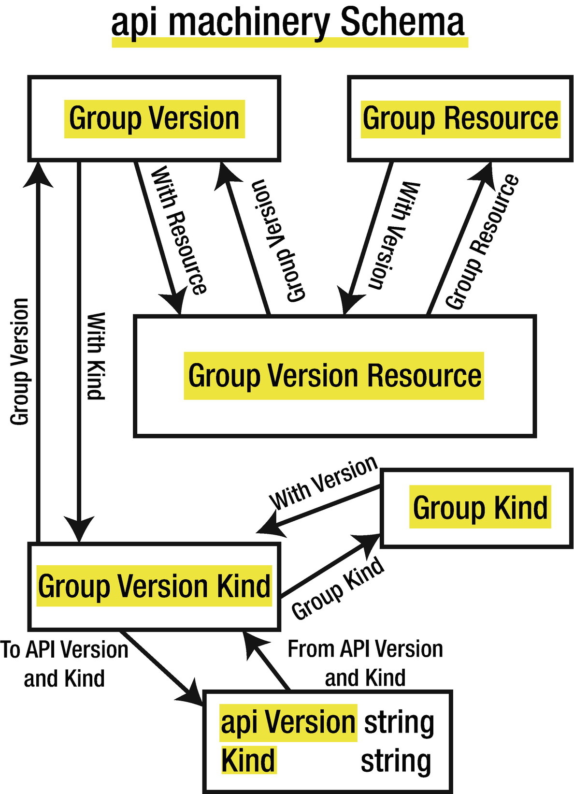

前面几章探讨了Kubernetes API在HTTP层面的工作方式。还探讨了 Kubernetes API 库，该库在Go中定义了由 Kubenretes API 提供的资源。

本章探讨了 Kubernetes API Machinery，它提供了用于处理遵循 Kubernetes API 对象约定的API对象的实用工具。这些约定包括：

- API对象嵌入了一个共同的元数据结构体，**TypeMeta**，包含两个字段： **APIVersion** 和 **Kind**。
- API 对象是在一个单独的包中提供的。

- API 对象是有版本的。

- 提供了转换函数来转换不同的版本。


API Machinery 将提供以下实用程序：

- **Scheme**抽象，用于：

  - 将 API 对象注册为 Group-Version-Kinds


  - 不同版本的API对象之间的转换


  - 对API对象进行序列化/反序列化


- RESTMapper，在 API 对象（基于嵌入式 APIVersion 和 Kind）和资源名称（REST意义上的）之间进行映射。

本章详细介绍了 API Machinery 所提供的功能。

## Schema 包

API Machinery 的 schema 包定义了有用的结构体和函数来处理分组、版本、种类和资源。

```go
import (
    "k8s.io/apimachinery/pkg/runtime/schema"
)
```


定义了 GroupVersionResource、GroupVersionKind、GroupVersion、GroupResource 和 GroupKind 结构，以及从一个到另一个的转换方法。

此外，还提供了在 GroupVersionKind 和（apiVersion, kind）之间转换的函数： ToAPIVersionAndKind 和 FromAPIVersionAndKind。



### Scheme

Scheme 是一个抽象概念，用于将 API 对象注册为 Group-Version-Kinds，在不同版本的 API 对象之间进行转换，并将 API 对象序列化/反序列化。Scheme 是由运行时包中的 API Machinery 提供的一个结构体。这个结构体的所有字段都是未导出（unexported）的。

#### 初始化

Scheme 结构体可以通过 NewScheme 函数进行初始化：

```go
import (
    "k8s.io/apimachinery/pkg/runtime"
)
Scheme := runtime.NewScheme()
```

在结构体被初始化后，你可以用 AddKnownTypes 方法注册新的 API 对象，方法如下：

```go
func (s *Scheme) AddKnownTypes(gv schema.GroupVersion, types ...Object)
```

例如，为了将 Pod 和 ConfigMap 对象注册到 `core/v1` 分组，你可以使用：

```go
import (
    corev1 "k8s.io/api/core/v1"
    "k8s.io/apimachinery/pkg/runtime"
    "k8s.io/apimachinery/pkg/runtime/schema"
)
Scheme := runtime.NewScheme()
func init() {
     Scheme.AddKnownTypes(
        schema.GroupVersion{
            Group:   "",
            Version: "v1",
        },
        &corev1.Pod{},
        &corev1.ConfigMap{},
     )
}
```

通过这样做，API Machinery 将能够知道在执行与 pod 相关的请求时要使用的 Group-Version-Kind `core-v1-Pod` 必须是 `corev1.Pod` 结构体，而在执行与configmaps 相关的请求时要使用的 `core-v1-ConfigMap` 必须是 `corev1.ConfigMap` 结构体。

已经表明，API 对象可以被版本化。你可以通过这种方式为不同的版本注册同一个种类--例如，使用下面的方法来添加部署对象的v1和v1beta1版本：

```go
import (
    appsv1 "k8s.io/api/apps/v1"
    appsv1beta1 "k8s.io/api/apps/v1beta1"
    "k8s.io/apimachinery/pkg/runtime"
    "k8s.io/apimachinery/pkg/runtime/schema"
)
Scheme := runtime.NewScheme()
func init() {
   Scheme.AddKnownTypes(
      schema.GroupVersion{
         Group:   "apps",
         Version: "v1",
      },
      &appsv1.Deployment{},
   )
   Scheme.AddKnownTypes(
      schema.GroupVersion{
         Group:   "apps",
         Version: "v1beta1",
      },
      &appsv1beta1.Deployment{},
   )
}
```

建议在执行的一开始就初始化 Scheme 结构体并向其添加已知类型--例如，使用 init 函数。

#### Mapping/映射

初始化后，你可以使用结构体上的各种方法来映射 Goup-Version-Kinds 和 Go Types：

- `KnownTypes(gv schema.GroupVersion) map[string]reflect.Type` - 获得所有为特定 Group-Version 注册的 go 类型- 这里是 `app/v1`

  ```go
  types := Scheme.KnownTypes(schema.GroupVersion{
      Group:   "apps",
      Version: "v1",
  })
  -> ["Deployment": appsv1.Deployment]
  ```

- `VersionsForGroupKind(gk schema.GroupKind) []schema.GroupVersion` - 获取所有为特定种类（这里是 Deployment）注册的 Group-Version：

  ```go
  groupVersions := Scheme.VersionsForGroupKind(
  schema.GroupKind{
          Group: "apps",
          Kind:  "Deployment",
  })
  -> ["apps/v1" "apps/v1beta1"]
  ```

- `ObjectKinds(obj Object) ([]schema.GroupVersionKind, bool, error) `- 获得一个给定对象的所有可能的 Group-Version-Kinds，这里是`appsv1.Deployment`：

  ```go
  gvks, notVersioned, err := Scheme.ObjectKinds(&appsv1.Deployment{})
  -> ["apps/v1 Deployment"]
  ```

- `New(kind schema.GroupVersionKind) (Object, error) `- 给定 Group-Version-Kind构建对象：

  ```go
  obj, err := Scheme.New(schema.GroupVersionKind{
      Group:   "apps",
      Version: "v1",
      Kind:    "Deployment",
  })
  ```

​	这个方法返回一个类型为 runtime.Object 的值，这是一个由所有 API 对象实现的接口。该值的具体类型将是映射 `Group-Version-Kind` 到的对象，这里是appsv1.Deployment 。

#### 转换

Scheme 结构体按分组-版本（Group-Version）注册种类（kind）。通过向 Scheme 提供同一分组和不同版本的 kind 之间的转换函数，就有可能在同一分组的任何种类之间进行转换。

我们可以定义两个层次的转换函数：转换函数和生成的转换函数。转换函数是用手写的函数，而生成的转换函数是用转换生成工具生成的。

当在两个版本之间进行转换时，如果存在转换函数，它将优先于生成的转换函数。

#### 添加转换函数

这两个方法在 a 和 b 之间添加了一个转换函数，这两个对象的类型属于同一个分组。

```go
AddConversionFunc(
    a, b interface{},
    fn conversion.ConversionFunc,
) error

AddGeneratedConversionFunc(
    a, b interface{},
    fn conversion.ConversionFunc,
) error
```

a 和 b 的值必须是指向结构体的指针，可以是 nil 指针。转换函数的签名定义如下：

```go
type ConversionFunc func(
    a, b interface{},
    scope Scope,
) error
```

下面是一个例子，在 `apps/v1` 和 `apps/v1beta1` deployment 之间添加一个转换功能：

```go
Scheme.AddConversionFunc(
    (*appsv1.Deployment)(nil),
    (*appsv1beta1.Deployment)(nil),
    func(a, b interface{}, scope conversion.Scope) error{
        v1deploy := a.(*appsv1.Deployment)
        v1beta1deploy := b.(*appsv1beta1.Deployment)
        // make conversion here
        return nil
    })
```

至于将已知类型注册到 schema 中，建议在执行的最开始注册转换函数--例如，使用 init 函数。

#### 转换

一旦转换函数被注册，就可以用转换函数在同一类型的两个版本之间进行转换。

```go
Convert(in, out interface{}, context interface{}) error
```

这个例子定义了一个 `v1.Deployment`，然后将其转换为 `v1beta1` 版本：

```go
v1deployment := appsv1.Deployment{
    [...]
}
v1deployment.SetName("myname")
var v1beta1Deployment appsv1beta1.Deployment
scheme.Convert(&v1deployment, &v1beta1Deployment, nil)
```

#### 序列化

API Machinery 的包提供了各种格式的序列化器： JSON、YAML 和 Protobuf。这些序列化器实现了序列化器接口，它嵌入了编码器和解码器接口。首先，你可以看到如何为不同的格式实例化序列化器，然后如何使用它们对 API 对象进行编码和解码。

##### JSON和YAML序列化器

json 包为 JSON 和 YAML 格式提供了一个序列化器。

```go
import (
     "k8s.io/apimachinery/pkg/runtime/serializer/json"
)
```

NewSerializerWithOptions 函数被用来创建一个新的序列化器。

```go
NewSerializerWithOptions(
    meta      MetaFactory,
    creater   runtime.ObjectCreater,
    typer     runtime.ObjectTyper,
    options   SerializerOptions,
) *Serializer
```

这些选项提供了在 JSON 和 YAML 序列化器之间进行选择的可能性（Yaml 字段），为J SON 输出选择人类可读的输出（漂亮字段），并检查 JSON 和 YAML 中的重复字段（**Stric** /严格字段）。

```go
type SerializerOptions struct {
    Yaml     bool
    Pretty   bool
    Strict   bool
}
```

Scheme 可以用于 **creator** 和 **typer** ，因为它实现了这两个接口，而 SimpleMetaFactory 结构体可以作为 **meta**。

```go
serializer := jsonserializer.NewSerializerWithOptions(
    jsonserializer.SimpleMetaFactory{},
    Scheme,
    Scheme,
    jsonserializer.SerializerOptions{
        Yaml: false, // or true for YAML serializer
        Pretty: true, // or false for one-line JSON
        Strict: false, // or true to check duplicates
     },
)
```

##### Protobuf序列化器

protobuf 包为 Protobuf 格式提供了一个序列化器。

```go
import (
     "k8s.io/apimachinery/pkg/runtime/serializer/protobuf"
)
```

NewSerializer 函数被用来创建一个新的序列化器。

```go
NewSerializer(
     creater     runtime.ObjectCreater,
     typer     runtime.ObjectTyper,
) *Serializer
```

Scheme 可以用于 **creator** 和 **typer** ，因为它实现了这两个接口。

```go
serializer := protobuf.NewSerializer(Scheme, Scheme)
```

#### 编码和解码

各种序列化器实现了 **Serializer** 接口，它嵌入了 **Decoder** 和 **Encoder** 接口，定义了 **Encode** 和 **Decode** 方法。

- `Encode(obj Object, w io.Writer) error` - Encode函数将一个API对象作为参数，对该对象进行编码，并使用 Writer 写入结果。

- decode 函数接收一个字节数组作为参数，并尝试解码其内容。如果要解码的内容没有指定 apiVersion 和 Kind，将使用默认的 GroupVersionKind（GVK）。

  ```go
  Decode(
      data []byte,
      defaults *schema.GroupVersionKind,
      into Object,
  ) (
      Object,
      *schema.GroupVersionKind,
      error,
  )
  ```

  如果不是 nil，并且 into 的具体类型与内容GVK（初始类型或默认类型）相匹配，结果将被放置在 into 对象中。在任何情况下，结果将作为一个对象返回，应用于它的 GVK 将作为一个 GroupVersionKind 结构体返回。

### RESTMapper

API Machinery 提供了一个 RESTMapper 的概念，用于在 REST 资源和 Kinds 之间映射。

```go
import (
    "k8s.io/apimachinery/pkg/api/meta"
)
```

RESTMapping 类型提供了使用 RESTMapper 进行映射的结果：

```go
type RESTMapping struct {
    Resource            schema.GroupVersionResource
    GroupVersionKind    schema.GroupVersionKind
    Scope               RESTScope
}
```

正如第一章所讨论的，GVR（Group-Version-Resource，简称Resource）是用来建立请求的路径的。例如，要获得所有命名空间中的 deployment 列表，你将使用 `/apis/apps/v1/deployments` 这个路径，其中 apps 是分组，v1是版本，deployments 是（复数）资源名称。所以，一个由 API 管理的资源可以通过它的GVR来唯一识别。

当向这个路径发出请求时，通常你想交换数据，要么在创建或更新资源的请求中，要么在获取或列出资源的响应中。这种交换数据的格式被称为Kind（或GroupVersionKind），与资源有关。

RESTMapping 结构体将资源和其相关的 GroupVersionKind 结合起来。API machinery 提供了一个 RESTMapper 接口和一个默认实现 DefaultRESTMapper。

```go
type RESTMapper interface {
    RESTMapping(gk schema.GroupKind, versions ...string)
          (*RESTMapping, error)
    RESTMappings(gk schema.GroupKind, versions ...string)
           ([]*RESTMapping, error)
    KindFor(resource schema.GroupVersionResource)
           (schema.GroupVersionKind, error)
    KindsFor(resource schema.GroupVersionResource)
           ([]schema.GroupVersionKind, error)
    ResourceFor(input schema.GroupVersionResource)
           (schema.GroupVersionResource, error)
    ResourcesFor(input schema.GroupVersionResource)
           ([]schema.GroupVersionResource, error)
    ResourceSingularizer(resource string)
           (singular string, err error)
}
```

#### Kind 到 Resource

RESTMapping 和 RESTMappings 方法返回一个元素或一个 RESTMapping 结构体数组作为结果，给定一个分组和Kind。一个可选的版本列表表示首选版本。

RESTMappings 方法返回所有匹配，RESTMapping 方法返回单个匹配，如果有多个匹配，则返回错误。得到的 RESTMapping 元素将包含完全合格的Kind（包括版本）和完全合格的资源。

总而言之，这些方法是用来将 Kind 映射到资源。

#### 资源到 kind

KindFor 和 KindsFor 方法返回一个 GroupVersionKind 的元素或数组，给定一个部分 Group-Version-Resource。部分意味着你可以省略分组，版本，或两者。资源名称可以是资源的单数或复数名称。

KindsFor 方法返回所有的匹配，KindFor 方法返回单个匹配，如果有多个匹配，则返回错误。

总而言之，这些方法是用来将资源映射到 kind。

#### 寻找资源

ResourceFor 和 ResourcesFor 方法返回一个 GroupVersionResource 的元素或数组，给出一个部分 Group-Version-Resource。部分的意思是你可以省略分组，版本，或两者。资源名称可以是资源的单数或复数名称。

ResourcesFor 方法返回所有的匹配结果，ResourceFor 方法返回单个匹配结果，如果有多个匹配结果，则返回一个错误。

总而言之，这些方法是用来根据单数或复数的资源名称寻找完全合格的资源。

#### 默认的RESTMapper实现

API Machinery 提供了一个 RESTMapper 的默认实现。

- NewDefaultRESTMapper

    ```go
    NewDefaultRESTMapper( 
    
        defaultGroupVersions []schema.GroupVersion,
    ) *DefaultRESTMapper
    ```

​	该工厂方法用于构建一个新的 DefaultRESTMapper，并接受一个默认 Group-Versions 列表，当所提供的GVR是部分的时候，该列表将被用来查找资源或Kinds。

- Add

​	`Add(kind schema.GroupVersionKind, scope RESTScope) `- 该方法用于添加 Kind 和资源之间的映射。资源名称将从 Kind 中猜测出来，方法是获得小写的单词，并将其复数化（在以 "s "结尾的单词中添加 "es"，在以 "y "结尾的单词中用 "ies "替换终端 "y"，并在其他单词中添加 "s"）。

- AddSpecific

  ```go
  AddSpecific(
      kind schema.GroupVersionKind、
      plural, singular schema.GroupVersionResource、
      scope RESTScope)
  ```

  这个方法用于通过明确给出单数和复数的名称来添加 Kind 和资源之间的映射。

创建 DefaultRESTMapper 实例后，你可以通过调用同名接口中定义的方法将其作为 RESTMapper 使用。

## 结语

本章探讨了API Machinery，介绍了用于在 Go 和 JSON 或 YAML 之间序列化资源的 Scheme 抽象，以及在几个版本之间转换资源。本章还介绍了 RESTMapper 接口，帮助在资源和 kind 之间进行映射。

下一章介绍了 Client-go 库，这是一个高层次的库，开发者用来调用 Kubernetes API，而不需要使用HTTP调用。