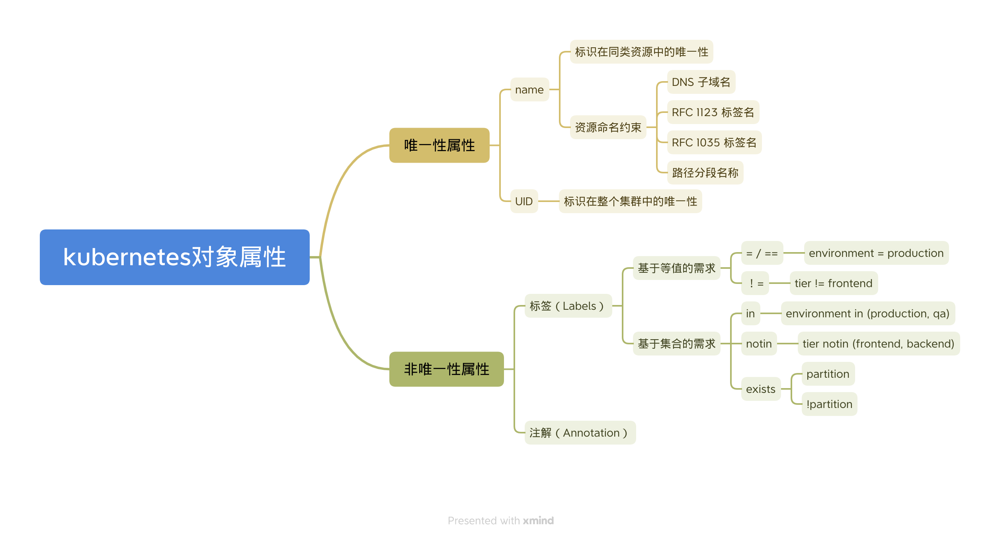

> https://kubernetes.io/zh-cn/docs/concepts/overview/working-with-objects/kubernetes-objects/

## 理解 Kubernetes 对象

在 Kubernetes 系统中，**Kubernetes 对象** 是持久化的实体。 Kubernetes 使用这些实体去表示整个集群的状态。 比较特别地是，它们描述了如下信息：

- 哪些容器化应用正在运行（以及在哪些节点上运行）
- 可以被应用使用的资源
- 关于应用运行时表现的策略，比如重启策略、升级策略以及容错策略

Kubernetes 对象是“目标性记录” —— 一旦创建该对象，Kubernetes 系统将不断工作以确保该对象存在。 通过创建对象，你就是在告知 Kubernetes 系统，你想要的集群工作负载状态看起来应是什么样子的， 这就是 Kubernetes 集群所谓的 **期望状态（Desired State）**。

## 对象规约（Spec）与状态（Status）

几乎每个 Kubernetes 对象包含两个嵌套的对象字段，它们负责管理对象的配置： 对象 spec（规约） 和 对象 status（状态）。 对于具有 spec 的对象，你必须在创建对象时设置其内容，描述你希望对象所具有的特征： 期望状态（Desired State）。

status 描述了对象的当前状态（Current State），它是由 Kubernetes 系统和组件设置并更新的。 在任何时刻，Kubernetes 控制平面 都一直都在积极地管理着对象的实际状态，以使之达成期望状态。

例如，Kubernetes 中的 Deployment 对象能够表示运行在集群中的应用。 当创建 Deployment 时，可能会去设置 Deployment 的 spec，以指定该应用要有 3 个副本运行。 Kubernetes 系统读取 Deployment 的 spec， 并启动我们所期望的应用的 3 个实例 —— 更新状态以与规约相匹配。 如果这些实例中有的失败了（一种状态变更），Kubernetes 系统会通过执行修正操作来响应 spec 和状态间的不一致 —— 意味着它会启动一个新的实例来替换。

> 笔记：spec 必须在创建对象时设置，这是期望状态（Desired State）。status 是当前状态（Current State），由 Kubernetes 系统和组件设置并更新的。

### 描述 Kubernetes 对象

创建 Kubernetes 对象时，必须提供对象的 `spec`，用来描述该对象的期望状态， 以及关于对象的一些基本信息（例如名称）。 当使用 Kubernetes API 创建对象时（直接创建，或经由 `kubectl`）， API 请求必须在请求本体中包含 JSON 格式的信息。 **大多数情况下，你需要提供 `.yaml` 文件为 kubectl 提供这些信息**。 `kubectl` 在发起 API 请求时，将这些信息转换成 JSON 格式。

### 必需字段

在想要创建的 Kubernetes 对象所对应的 `.yaml` 文件中，需要配置的字段如下：

- `apiVersion` - 创建该对象所使用的 Kubernetes API 的版本
- `kind` - 想要创建的对象的类别
- `metadata` - 帮助唯一标识对象的一些数据，包括一个 `name` 字符串、`UID` 和可选的 `namespace`
- `spec` - 你所期望的该对象的状态

## 笔记

