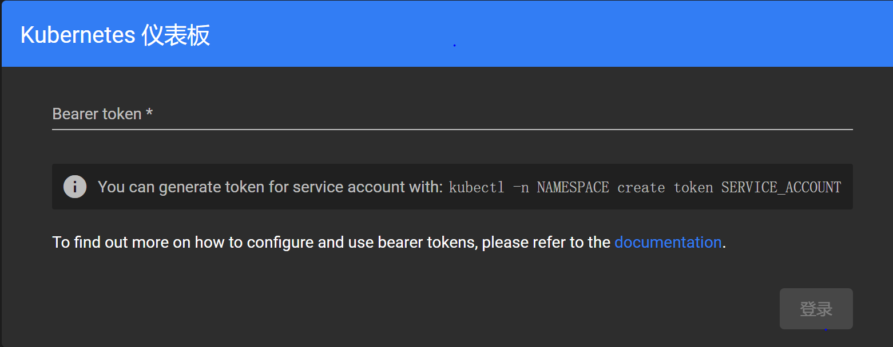

## 安装 dashboard

参考：https://github.com/kubernetes/dashboard/#installation

在下面地址上查看当前 dashboard 的版本：

https://github.com/kubernetes/dashboard/releases

根据对 kubernetes 版本的兼容情况选择对应的 dashboard 的版本：

- kubernetes-dashboard-7.11.0  ，兼容 k8s 1.32

最新版本需要用 helm 进行安装：

```bash
helm repo add kubernetes-dashboard https://kubernetes.github.io/dashboard/
helm upgrade --install kubernetes-dashboard kubernetes-dashboard/kubernetes-dashboard --create-namespace --namespace kubernetes-dashboard
```

输出为：

```bash
"kubernetes-dashboard" already exists with the same configuration, skipping
Release "kubernetes-dashboard" does not exist. Installing it now.
NAME: kubernetes-dashboard
LAST DEPLOYED: Wed Mar  5 00:53:17 2025
NAMESPACE: kubernetes-dashboard
STATUS: deployed
REVISION: 1
TEST SUITE: None
NOTES:
*************************************************************************************************
*** PLEASE BE PATIENT: Kubernetes Dashboard may need a few minutes to get up and become ready ***
*************************************************************************************************

Congratulations! You have just installed Kubernetes Dashboard in your cluster.

To access Dashboard run:
  kubectl -n kubernetes-dashboard port-forward svc/kubernetes-dashboard-kong-proxy 8443:443

NOTE: In case port-forward command does not work, make sure that kong service name is correct.
      Check the services in Kubernetes Dashboard namespace using:
        kubectl -n kubernetes-dashboard get svc

Dashboard will be available at:
  https://localhost:8443
```

此时 dashboard 的 service 和 pod 情况：

```bash
kubectl -n kubernetes-dashboard get services
```

输出为：

```bash
NAME                                   TYPE        CLUSTER-IP       EXTERNAL-IP   PORT(S)    AGE
kubernetes-dashboard-api               ClusterIP   10.108.225.190   <none>        8000/TCP   2m5s
kubernetes-dashboard-auth              ClusterIP   10.99.205.102    <none>        8000/TCP   2m5s
kubernetes-dashboard-kong-proxy        ClusterIP   10.96.247.162    <none>        443/TCP    2m5s
kubernetes-dashboard-metrics-scraper   ClusterIP   10.103.222.22    <none>        8000/TCP   2m5s
kubernetes-dashboard-web               ClusterIP   10.108.219.9     <none>        8000/TCP   2m5s
```

查看 pod 的情况：

```bash
kubectl -n kubernetes-dashboard get pods
```

等待两三分钟之后，pod 启动完成，输出为：    

```bash
NAME                                                    READY   STATUS    RESTARTS   AGE
kubernetes-dashboard-api-7d8567b8f-9ksk2                1/1     Running   0          3m8s
kubernetes-dashboard-auth-6877bf44b9-9qfmg              1/1     Running   0          3m8s
kubernetes-dashboard-kong-79867c9c48-rzlhp              1/1     Running   0          3m8s
kubernetes-dashboard-metrics-scraper-794c587449-6phjv   1/1     Running   0          3m8s
kubernetes-dashboard-web-75576c76b-sm2wj                1/1     Running   0          3m8s
```

为了方便，使用 node port 来访问 dashboard，需要执行：

```bash
kubectl -n kubernetes-dashboard edit service kubernetes-dashboard-kong-proxy
```

然后修改 `type: ClusterIP` 为 `type: NodePort`。然后看一下具体分配的 node port 是哪个：

```bash
kubectl -n kubernetes-dashboard get service kubernetes-dashboard-kong-proxy
```

输出为：

```bash
NAME                              TYPE       CLUSTER-IP      EXTERNAL-IP   PORT(S)         AGE
kubernetes-dashboard-kong-proxy   NodePort   10.96.247.162   <none>        443:32616/TCP   17m
```

现在可以用浏览器直接访问：

https://192.168.3.215:32616/



### 创建用户并登录 dashboard

参考：[Creating sample user](https://github.com/kubernetes/dashboard/blob/master/docs/user/access-control/creating-sample-user.md)

创建 admin-user 用户：

```bash
vi dashboard-adminuser.yaml
```

内容为:

```yaml
apiVersion: v1
kind: ServiceAccount
metadata:
  name: admin-user
  namespace: kubernetes-dashboard
```

执行：

```bash
k create -f dashboard-adminuser.yaml
```

然后绑定角色：

``` bash
vi dashboard-adminuser-binding.yaml
```

内容为:

```yaml
apiVersion: rbac.authorization.k8s.io/v1
kind: ClusterRoleBinding
metadata:
  name: admin-user
roleRef:
  apiGroup: rbac.authorization.k8s.io
  kind: ClusterRole
  name: cluster-admin
subjects:
- kind: ServiceAccount
  name: admin-user
  namespace: kubernetes-dashboard
```

执行：

```bash
k create -f dashboard-adminuser-binding.yaml
```

然后创建 token ：

```bash
kubectl -n kubernetes-dashboard create token admin-user
```

输出为:

```bash
eyJhbGciOiJSUzI1NiIsImtpZCI6Ik9sWnJsTk5UNE9JVlVmRFMxMUpwNC1tUlVndTl5Zi1WQWtmMjIzd2hDNmcifQ.eyJhdWQiOlsiaHR0cHM6Ly9rdWJlcm5ldGVzLmRlZmF1bHQuc3ZjLmNsdXN0ZXIubG9jYWwiXSwiZXhwIjoxNzQxMTEyNDg4LCJpYXQiOjE3NDExMDg4ODgsImlzcyI6Imh0dHBzOi8va3ViZXJuZXRlcy5kZWZhdWx0LnN2Yy5jbHVzdGVyLmxvY2FsIiwianRpIjoiNDU5ZGQxNjctNWI5OS00MWIzLTgzZWEtNGIxMGY3MTc5ZjEyIiwia3ViZXJuZXRlcy5pbyI6eyJuYW1lc3BhY2UiOiJrdWJlcm5ldGVzLWRhc2hib2FyZCIsInNlcnZpY2VhY2NvdW50Ijp7Im5hbWUiOiJhZG1pbi11c2VyIiwidWlkIjoiZjMxN2VhZTItNTNiNi00MGZhLWI3MWYtMzZiNDI1YmY4YWQ0In19LCJuYmYiOjE3NDExMDg4ODgsInN1YiI6InN5c3RlbTpzZXJ2aWNlYWNjb3VudDprdWJlcm5ldGVzLWRhc2hib2FyZDphZG1pbi11c2VyIn0.TYzOdrMFXcSEeVMbc1ewIA13JVi4FUYoRN7rSH5OstbVfKIF48X_o1RWxOGM_AurhgLxuKZHzmns3K_pX_OR3u1URfK6-gGos4iAQY-H1yntfRmzzsip_FbZh95EYFGTN43gw21jTyfem3OKBXXLgzsnVT_29uMnJzSnCDnrAciVKMoCEUP6x2RSHQhp6PrxrIrx_NMB3vojEZYq3AysQoNqYYjRDd4MnDRClm03dNvW5lvKSgNCVmZFje_EEa2EhI2X6d3X8zx6tHwT5M4-T3hMmyIpzHUwf3ixeZR85rhorMbskNVvRpH6VLH6BXP31c3NMeSgYk3BG8d7UjCYxQ
```

这个 token 就可以用在 kubernetes-dashboard 的登录页面上了。

为了方便，将这个 token 存储在 Secret ：

``` bash
vi dashboard-adminuser-secret.yaml
```

内容为:

```yaml
apiVersion: v1
kind: Secret
metadata:
  name: admin-user
  namespace: kubernetes-dashboard
  annotations:
    kubernetes.io/service-account.name: "admin-user"   
type: kubernetes.io/service-account-token
```

执行：

```bash
k create -f dashboard-adminuser-secret.yaml
```

之后就可以用命令随时获取这个 token 了：

```bash
kubectl get secret admin-user -n kubernetes-dashboard -o jsonpath="{.data.token}" | base64 -d
```
