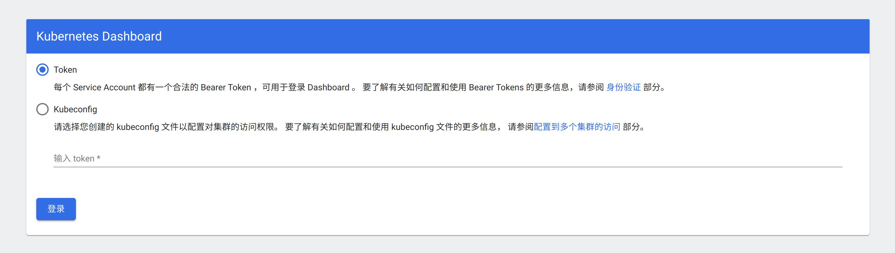

参考资料：

- [Deploy and Access the Kubernetes Dashboard](https://kubernetes.io/docs/tasks/access-application-cluster/web-ui-dashboard/)
- [Web 界面 (Dashboard)](https://kubernetes.io/zh/docs/tasks/access-application-cluster/web-ui-dashboard/): 上文的中文版本

## 部署dashboard

在下面地址上查看当前dashboard的版本：

https://github.com/kubernetes/dashboard/releases 

根据对kubernetes版本的兼容情况选择对应的dashboard的版本：

- dashboard 2.7 ： 全面兼容 k8s 1.25
- dashboard 2.6.1 ： 全面兼容 k8s 1.24
- dashboard 2.5.1： 全面兼容 k8s 1.23

通过如下命令部署：

```bash
kubectl apply -f https://raw.githubusercontent.com/kubernetes/dashboard/v2.5.1/aio/deploy/recommended.yaml
```

其中版本号可以查看 https://github.com/kubernetes/dashboard/releases

部署成功之后，可以看到 kubernetes-dashboard 相关的两个pod：

```bash
$ k get pods -A          
NAMESPACE              NAME                                         READY   STATUS    RESTARTS      AGE
kubernetes-dashboard   dashboard-metrics-scraper-799d786dbf-krhln   1/1     Running   0             11m
kubernetes-dashboard   kubernetes-dashboard-6b6b86c4c5-ptstx        1/1     Running   0             8h
```

和 kubernetes-dashboard 相关的两个service：

```bash
$ k get services -A 
NAMESPACE              NAME                        TYPE        CLUSTER-IP       EXTERNAL-IP   PORT(S)                  AGE
kubernetes-dashboard   dashboard-metrics-scraper   ClusterIP   10.103.242.118   <none>        8000/TCP                 8h
kubernetes-dashboard   kubernetes-dashboard        ClusterIP   10.106.3.227     <none>        443/TCP                  8h
```

## 访问dashboard

参考官方文章： https://github.com/kubernetes/dashboard/blob/master/docs/user/accessing-dashboard/README.md

前面部署 dashboard 时使用的是 recommended 配置，和文章要求一致。

当前集群信息如下：

```bash
$ kubectl cluster-info
Kubernetes control plane is running at https://192.168.0.41:6443
CoreDNS is running at https://192.168.0.41:6443/api/v1/namespaces/kube-system/services/kube-dns:dns/proxy
```

### kubectl proxy

直接 `kubectl proxy` 启动的是本地代理服务器，只能通过 localhost 访问，这个只适合本地单集群使用：

```bash
$ k proxy          
Starting to serve on 127.0.0.1:8001
```

### kubectl port-forward

```bash
$ kubectl port-forward -n kubernetes-dashboard service/kubernetes-dashboard 8080:443
Forwarding from 127.0.0.1:8080 -> 8443
Forwarding from [::1]:8080 -> 8443
```

类似的，也只能本地访问 https://localhost:8080 。

### NodePort

执行:

```bash
kubectl -n kubernetes-dashboard edit service kubernetes-dashboard
```

修改 `type: ClusterIP` 为 `type: NodePort`:

```yaml
apiVersion: v1
...
  name: kubernetes-dashboard
  namespace: kubernetes-dashboard
  resourceVersion: "343478"
  selfLink: /api/v1/namespaces/kubernetes-dashboard/services/kubernetes-dashboard
  uid: 8e48f478-993d-11e7-87e0-901b0e532516
spec:
  clusterIP: 10.100.124.90
  externalTrafficPolicy: Cluster
  ports:
  - port: 443
    protocol: TCP
    targetPort: 8443
  selector:
    k8s-app: kubernetes-dashboard
  sessionAffinity: None
  type: ClusterIP
```

看一下具体分配的 node port 是哪个：

```bash
$ kubectl -n kubernetes-dashboard get service kubernetes-dashboard
NAME                   TYPE       CLUSTER-IP     EXTERNAL-IP   PORT(S)         AGE
kubernetes-dashboard   NodePort   10.106.3.227   <none>        443:32212/TCP   9h
```

可以看到这里分配的是 32212 端口。

然后就是 node 的 ip 地址了，如果是单节点的集群，那么 node ip 就固定为 master node 的IP，可以通过 `kubectl cluster-info` 获取。如果是多节点的集群，则需要找到 kubernetes-dashboard 服务被部署到了哪个节点。

```bash
$ k get pods -A -o wide | grep kubernetes-dashboard
kubernetes-dashboard   dashboard-metrics-scraper-799d786dbf-krhln   1/1     Running   0             32m   10.244.1.3     skyserver2   <none>           <none>
kubernetes-dashboard   kubernetes-dashboard-6b6b86c4c5-ptstx        1/1     Running   0             9h    10.244.1.2     skyserver2   <none>           <none>
```

如图 kubernetes-dashboard 服务被部署到了 skyserver2 节点，skyserver2 的 IP 是 192.168.0.50，则拼合起来的地址是

> https://192.168.0.50:32212

或者为了方便起见，将每台node的名字和IP地址绑定，通过 `sudo vi /ete/hosts` 修改hosts文件，增加以下内容：

```properties
# node IP
192.168.0.10            skywork
192.168.0.20            skywork2
192.168.0.40            skyserver
192.168.0.50            skyserver2
```

之后就可以通过 https://skyserver2:32212 访问了。

### 特别事项：浏览器对自签名证书网站的访问处理

使用浏览器访问该地址时，可以连接上，但是浏览器会因为网站使用的是自签名证书而报错 "此网站连接不安全" 拒绝访问。

各浏览器的处理：

- edag：拒绝访问，可以使用魔术短语： `thisisunsafe` （没有输入框，只要单击该页面以确保它具有焦点，然后键盘输入即可）
- firefox：默认拒绝，选择"接受风险并继续"后可以正常访问
- Chrome：待测试，应该可以使用魔术短语： `thisisunsafe` 
- Safari: 默认拒绝,点击 "Show details" -> "visit this website" -> "visit website" 可以绕开限制继续访问

参考:

- [怎样绕过自签名SSL / TLS证书的HTTPS警告](https://bynss.com/linux/467464.html)

### 登录Dashboard



#### 通过token登录

token可以通过下面的命令简单获取到：

```bash
kubectl -n kube-system describe $(kubectl -n kube-system get secret -n kube-system -o name | grep namespace) | grep token
```

输出为:

```bash
$ kubectl -n kube-system describe $(kubectl -n kube-system get secret -n kube-system -o name | grep namespace) | grep token
Name:         namespace-controller-token-r87br
Type:  kubernetes.io/service-account-token
token:      eyJhbGciOiJSUzI1NiIsImtpZCI6ImNuYUVPT3FRR0dVOFBmN3pFeW81Y1p5R004RVh6VGtJUUpfSHo1ZVFMUVEifQ.eyJpc3MiOiJrdWJlcm5ldGVzL3NlcnZpY2VhY2NvdW50Iiwia3ViZXJuZXRlcy5pby9zZXJ2aWNlYWNjb3VudC9uYW1lc3BhY2UiOiJrdWJlLXN5c3RlbSIsImt1YmVybmV0ZXMuaW8vc2VydmljZWFjY291bnQvc2VjcmV0Lm5hbWUiOiJuYW1lc3BhY2UtY29udHJvbGxlci10b2tlbi1yODdiciIsImt1YmVybmV0ZXMuaW8vc2VydmljZWFjY291bnQvc2VydmljZS1hY2NvdW50Lm5hbWUiOiJuYW1lc3BhY2UtY29udHJvbGxlciIsImt1YmVybmV0ZXMuaW8vc2VydmljZWFjY291bnQvc2VydmljZS1hY2NvdW50LnVpZCI6ImU2NjU3ODI3LTc4NTUtNDAzOC04MmJjLTlmMjI0OWM3NzYyZiIsInN1YiI6InN5c3RlbTpzZXJ2aWNlYWNjb3VudDprdWJlLXN5c3RlbTpuYW1lc3BhY2UtY29udHJvbGxlciJ9.sVRT_x5NB4sqYwyyqn2Mm3hKg1jhvCsCDMbm_JY-3a19tknzwv_ZPpGOHWrPxmCG45_-tHExi7BbbGK1ZAky2UjtEpxmtVNR6yqHRMYvXtqifqHI4yS6ig-t5WiZ0a4h1q6xZfWsM9nlINSTGQbguCCN2kXUYyAZ0HPdPhdFtmyH9_fjI-FXQOPeK9t9GfWn9Nm52T85spzriwOMY96fFXZ3YaiuzfY5aBtGoxLwDu7O2GOazBmeFaRzEEGR0RjgdM7WPFmtDvbaidIJDPkLznqftqwUFeWHjz6-toO8iaKW_QKHFBvZTQ6uXSc__tbcSYyThu3Ty97-Ml8TArhacw
```

复制这里的 token 提交就可以登录。

参考：

- https://segmentfault.com/a/1190000013681047

#### 通过kubeconf文件登录

在 kebeconf 文件（路径为 `~/.kube/config`）中加入 token 信息:

```yaml
apiVersion: v1
clusters:
- cluster:
    certificate-authority-data: XXXXXX==
    server: https://192.168.0.41:6443
  name: kubernetes
contexts:
- context:
    cluster: kubernetes
    user: kubernetes-admin
  name: kubernetes-admin@kubernetes
current-context: kubernetes-admin@kubernetes
kind: Config
preferences: {}
users:
- name: kubernetes-admin
  user:
    client-certificate-data: XXXXX==
    client-key-data: XXXX=
    token: eyJhbGciOiJSUzI1NiIsImtpZCI6ImNuYUVPT3FRR0dVOFBmN3pFeW81Y1p5R004RVh6VGtJUUpfSHo1ZVFMUVEifQ.eyJpc3MiOiJrdWJlcm5ldGVzL3NlcnZpY2VhY2NvdW50Iiwia3ViZXJuZXRlcy5pby9zZXJ2aWNlYWNjb3VudC9uYW1lc3BhY2UiOiJrdWJlLXN5c3RlbSIsImt1YmVybmV0ZXMuaW8vc2VydmljZWFjY291bnQvc2VjcmV0Lm5hbWUiOiJuYW1lc3BhY2UtY29udHJvbGxlci10b2tlbi1yODdiciIsImt1YmVybmV0ZXMuaW8vc2VydmljZWFjY291bnQvc2VydmljZS1hY2NvdW50Lm5hbWUiOiJuYW1lc3BhY2UtY29udHJvbGxlciIsImt1YmVybmV0ZXMuaW8vc2VydmljZWFjY291bnQvc2VydmljZS1hY2NvdW50LnVpZCI6ImU2NjU3ODI3LTc4NTUtNDAzOC04MmJjLTlmMjI0OWM3NzYyZiIsInN1YiI6InN5c3RlbTpzZXJ2aWNlYWNjb3VudDprdWJlLXN5c3RlbTpuYW1lc3BhY2UtY29udHJvbGxlciJ9.sVRT_x5NB4sqYwyyqn2Mm3hKg1jhvCsCDMbm_JY-3a19tknzwv_ZPpGOHWrPxmCG45_-tHExi7BbbGK1ZAky2UjtEpxmtVNR6yqHRMYvXtqifqHI4yS6ig-t5WiZ0a4h1q6xZfWsM9nlINSTGQbguCCN2kXUYyAZ0HPdPhdFtmyH9_fjI-FXQOPeK9t9GfWn9Nm52T85spzriwOMY96fFXZ3YaiuzfY5aBtGoxLwDu7O2GOazBmeFaRzEEGR0RjgdM7WPFmtDvbaidIJDPkLznqftqwUFeWHjz6-toO8iaKW_QKHFBvZTQ6uXSc__tbcSYyThu3Ty97-Ml8TArhacw
```

默认生成的kebuconf文件是不带 token 字段的，加上即可。

然后在页面上提交这个 kebuconf 文件即可登录。相比token登录方式，不需要每次去获取token内容，一次保存之后以后方便很多。

