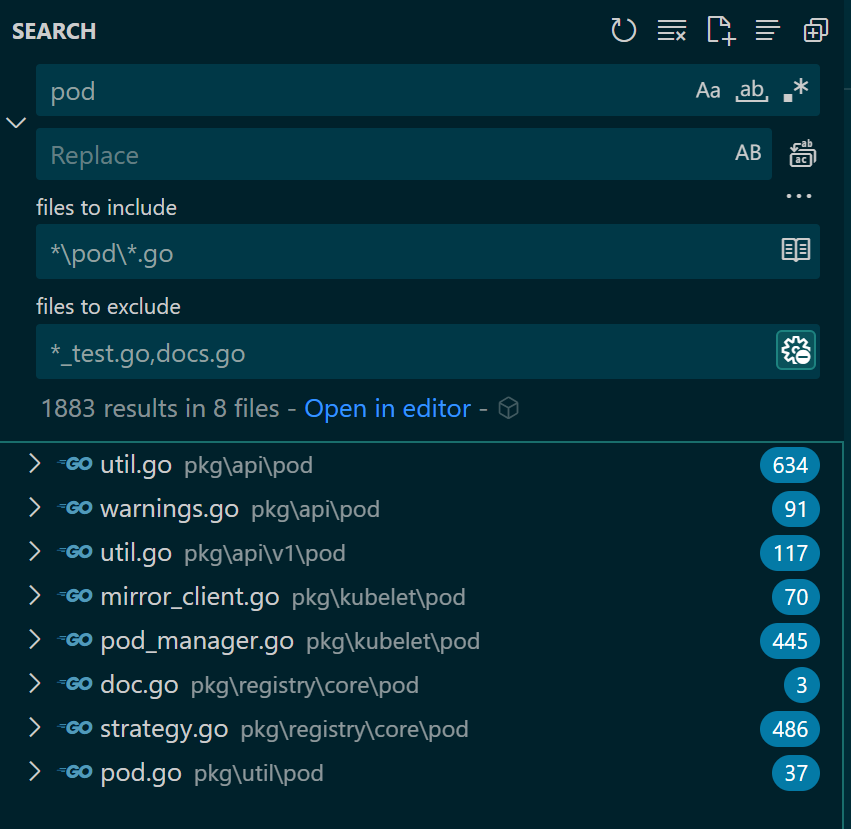

### 相关代码文件

搜索条件:

- "files to include": `*\pod\*.go`
- "files to exclude": `*_test.go,docs.go,doc.go,test\**\*.go`

找到的相关代码文件为：

文件列表具体为：

- pkg\api\pod\util.go
- pkg\api\pod\warnings.go
- pkg\api\v1\pod\util.go
- pkg\kubelet\pod\mirror_client.go
- pkg\kubelet\pod\pod_manager.go
- pkg\registry\core\pod\strategy.go
- pkg\util\pod\pod.go