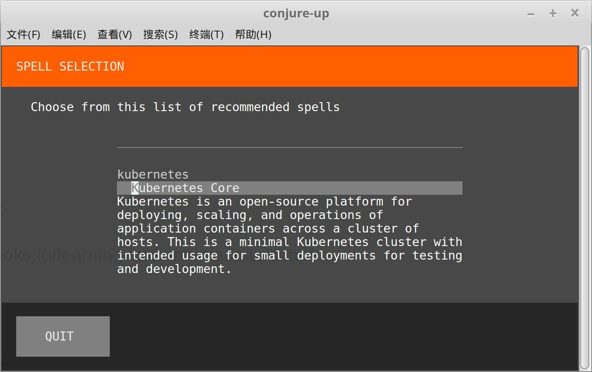
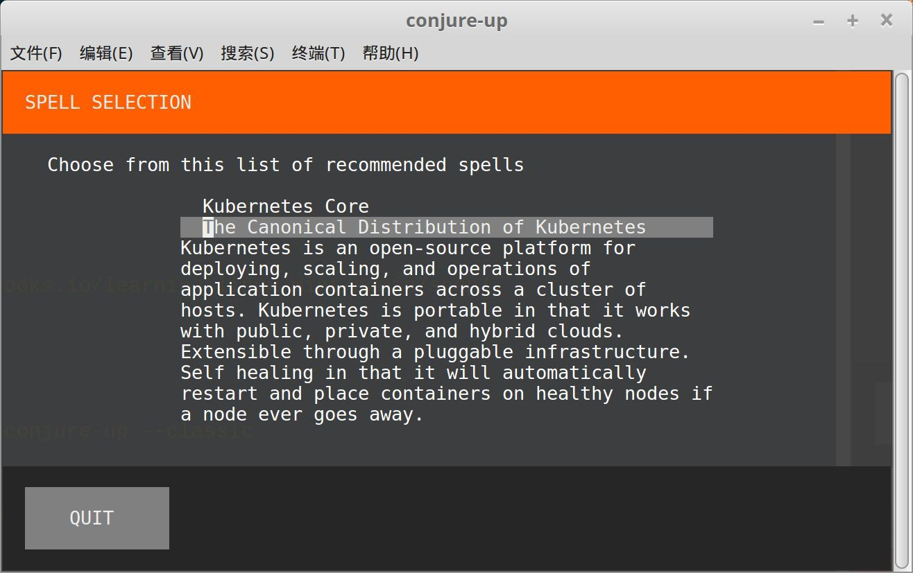
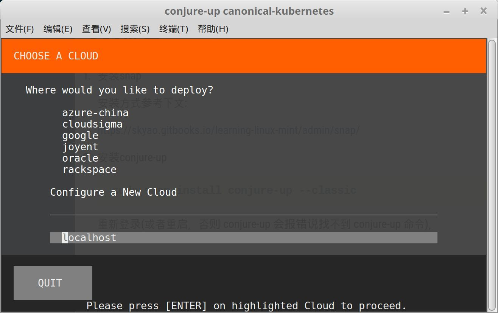
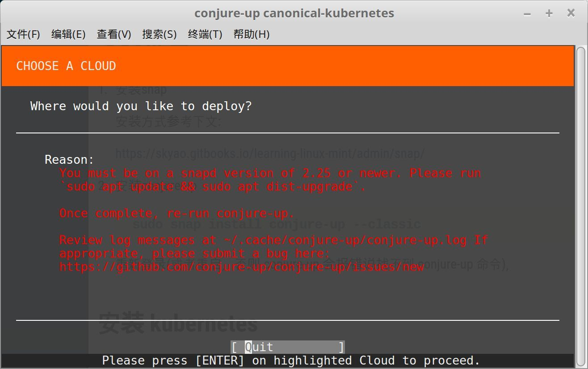
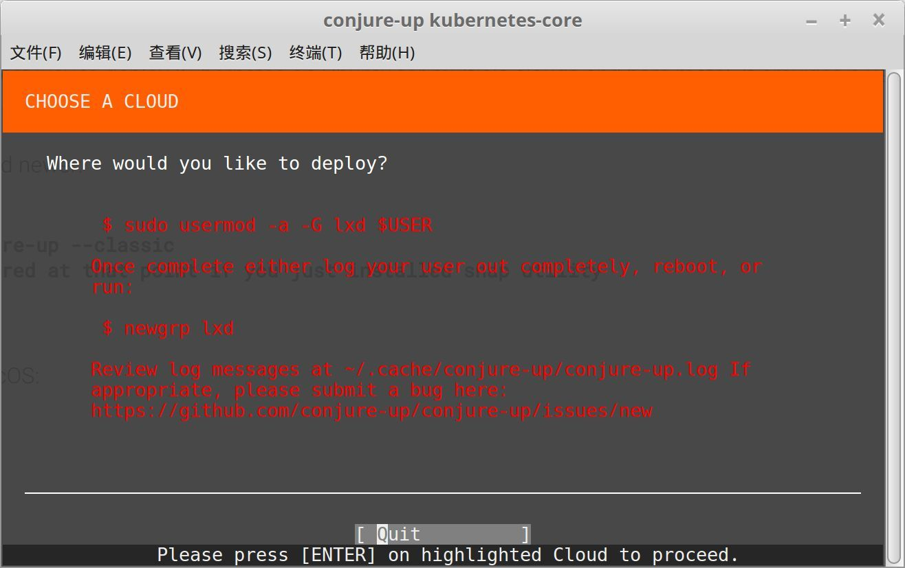
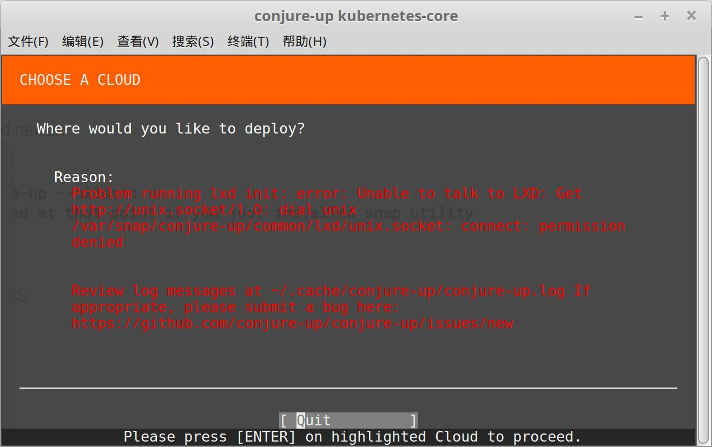
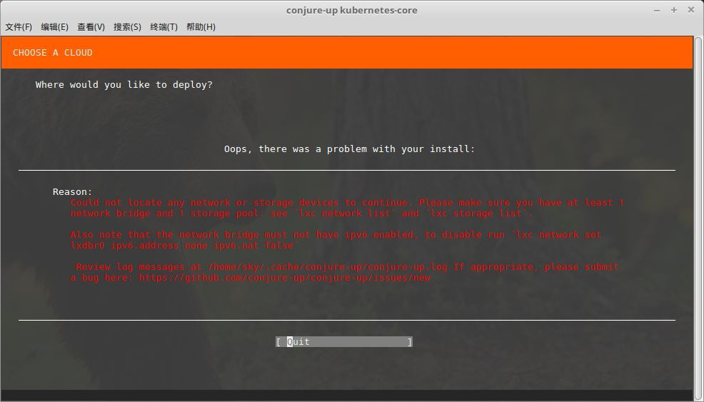
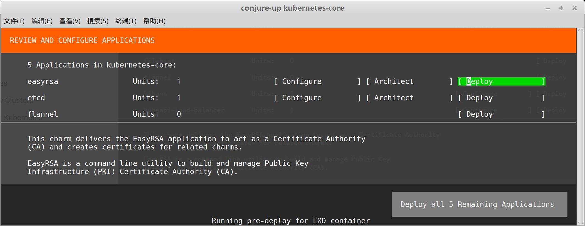
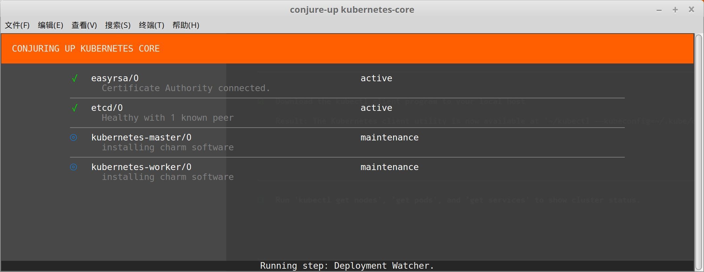
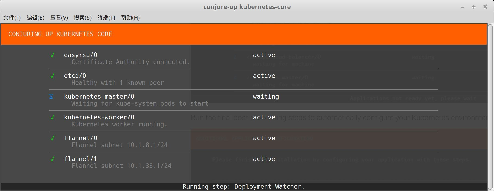

# 使用conjure-up安装

参考官方介绍的 ubuntu 安装方法:

- [Kubernetes on Ubuntu](https://www.ubuntu.com/containers/kubernetes)
- [The Canonical Distribution of Kubernetes](https://www.ubuntu.com/cloud/kubernetes)

## 安装准备

1. 安装snap

	安装方式参考下文:

	https://skyao.gitbooks.io/learning-linux-mint/admin/snap/

2. 安装conjure-up

	```bash
    sudo snap install conjure-up --classic
    ```

    重新登录(或者重启，否则 conjure-up 会报错说找不到 conjure-up 命令)，

## 安装 kubernetes

参考这里的步骤：

https://kubernetes.io/docs/getting-started-guides/ubuntu/

conjure-up的代理设置参考这个文章：

https://blog.felipe-alfaro.com/2017/04/04/juju-and-apt-cacher/

执行命令:

```bash
conjure-up kubernetes --apt-proxy http://localhost:8123 --apt-https-proxy http://localhost:8123
```

弹出窗口，选择安装类型，第一个选项是"Kubernetes Core":



第二个选项是"The Canonical Distribution of Kubernetes":



简单测试用选 "Kubernetes Core"，回车，然后选择云，这里我们选择"localhost" 来创建一个新的云：



陆续出现了很多错误，

1. 报错说版本不对

	

	这个错误是用了 `snappy-dev/edge` 这个ppa, 安装上去的 snap 和 snapd 的版本大于 2.25但是也会如上报错。

    解决的方法就是卸载 snap 然后修改ppa 为　`ppa:snappy-dev/tools` 再重新安装。

2. lxd设置

	

    安装提示，执行命令:

    ```bash
    sudo usermod -a -G lxd $USER
    newgrp lxd
    ```

3. lxd权限不够

    

    这个是当前账号的group不对，重启就好了。

4. 没有网络或者存储

	

	需要重新安装lxd，并初始化：

    ```bash
    sudo snap install lxd;
    /snap/bin/lxd init --auto
    ```

解决上面的问题后，就可以继续安装，



可以参考下文：

https://kubernetes.io/docs/getting-started-guides/ubuntu/local/

耐心等待，安装很慢，大概要等5-10分钟，然后就可以看到这个界面：


继续等待，需要很长时间，从网络监控看全程大概要下载2g多内容。





## 备注

### lxd优化

https://github.com/lxc/lxd/blob/master/doc/production-setup.md

### 删除juju controller

参考juju资料:

- https://jujucharms.com/docs/2.2/controllers
- https://docs.ubuntu.com/conjure-up/en/

```bash
juju controllers
juju destroy-controller ****
```

如果 destroy-controller 不成功，会提示用 kill-controller:

```bash
juju kill-controller ****
```